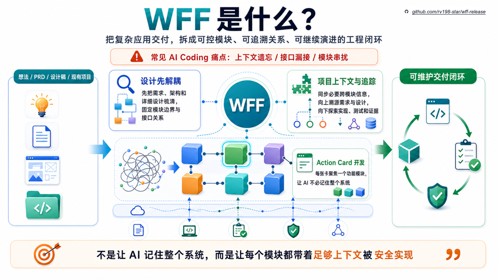

# Waterfall Flow Framework（WFF）

> Vibe Coding 给速度，SPEC 给意图，Harness 给运行证据；WFF 给复杂应用所需的可维护交付闭环。



项目地址：<[rv198-star/wff-release](https://github.com/rv198-star/wff-release)>

WFF 是给 AI Agent 用的软件生命周期框架。

它解决的不是“怎么让 AI 更猛”，而是“怎么避免把 AI 用错”。

复杂应用不是一次超长 prompt 就能稳定完成的事。需求会变，模块会互相影响，设计会取舍，代码要扩展，测试要补强，最后还要有人接手和判断能不能交付。把这一切都塞进一个上下文里，让 AI 一边写一边记住所有细节，本来就不合理。

这不是 AI 能力差。人也做不到不做设计、不拆任务、直接开写，还在几周后准确记住每个需求、接口、边界和风险。

WFF 的做法很朴素：**把复杂问题拆小，把每一步留下证据，把每个产物接回原始需求和设计来源。**

## WFF 是什么

WFF 把一个复杂软件工作拆成一串小而清楚的任务。

每一步都要说明：

- 输入来自哪里；
- 要产出什么；
- 这个产出对应哪条原始需求、设计材料或约束；
- 哪些测试、Harness 结果、Review 或 gate 能支撑它；
- 还有哪些结论现在不能说。

这样做的结果是：AI Agent 不需要一次性理解整个宇宙。它可以被委派去完成一个边界清楚的模块，完成后再把结果接回完整证据链。

这才是复杂应用能持续长大的前提：不是让 AI 硬扛更长上下文，而是让软件工程把上下文切小、切清楚、切得可追踪。

## 和你已经熟悉的东西有什么不同

**Vibe Coding 很快，但复杂应用会失控。**

Vibe Coding 适合探索、试错和快速看到结果。它的问题不是不能产出代码，而是当项目变大后，代码很容易不可维护：需求边界漂移，模块职责混在一起，后续功能越堆越怕改。demo 有了，产品却长不大。

**SPEC 能把意图写清楚，但不能自动保证实现不跑偏。**

SPEC 很重要。它让需求、约束、接口和验收先有文字依据。但如果后续还是把一大份规格、一堆代码和一长串修改要求全塞给 AI，注意力、遗忘和局部误解仍然会发生。文档写清楚，不等于代码、测试和交付声明会一直跟着它走。

**Harness 能提供运行证据，但运行通过不等于交付结论成立。**

Harness、测试、回放、smoke 和运行检查都很有价值。它们能告诉你某些行为确实跑过、测过、复现过。但复杂交付还要回答：这个行为对应哪条需求？覆盖了哪个风险？遗漏了什么边界？现在能声明到什么程度？

WFF 的位置就在这里：它不是继续把所有负担压给 AI 的记忆和注意力，而是用软件工程的方法拆解问题，让需求、设计、模块、代码、测试和证据一环扣一环。

## WFF 的特点

- **每一步都有迹可循**：产出物不是孤立文件，而是能回到原始需求、设计材料、约束或证据来源。
- **每个模块都能独立委派**：任务边界足够小，AI Agent 可以专注完成一个模块，而不是在超长上下文里猜全局。
- **上下文失控被结构性避开**：注意力漂移、遗忘、局部补丁互相打架，本质上来自任务太大；WFF 通过拆解和交接减少这种失控。
- **测试和 Harness 结果会回到交付语义**：不是只问“跑没跑”，还问“证明了什么、没证明什么”。
- **声明有上限**：证据只够证明多少，结论就只能说到多少。缺少真实环境、业务负责人或外部评审时，WFF 不会把它说成已经完成。

> WFF 不替 AI 吹牛。WFF 让 AI 交证据。

## 什么时候该用 WFF

你不需要先理解 WFF 的完整内部流程。第一次使用，先从 `using-wff` 开始，让它根据你手上的材料判断入口。

### 只有想法、聊天记录或零散材料

适合先把想法讲清楚，整理出需求来源、关键缺口、约束和后续要确认的问题。这个入口不是直接写代码，也不是假装已经有完整规格。

建议入口：

```text
using-wff -> wff-req-chat / wff-req
```

### 已有需求、规格、设计稿或接口材料

适合把已有材料变成可继续设计、实现、测试和追踪的工程输入。重点不是“再写一份文档”，而是把材料拆成后续 AI Agent 可以独立处理的小块。

建议入口：

```text
using-wff -> wff-req / wff-arch / wff-impl
```

### 已有代码系统、历史包袱或迁移改造任务

适合先看真实代码、数据、接口和风险，而不是只读旧文档就开始重构。WFF 会先分清事实、推断和未知数，再决定后续怎么走。

建议入口：

```text
using-wff -> wff-x
```

## 你会看到什么

WFF 运行后可能会产生很多文件，但用户不需要从机器日志开始读。

优先看这些：

- 面向人的主读文档：需求、设计、实现任务、验证和收口摘要。
- 证据材料：测试报告、Harness 结果、gate 报告、AI Review、proof snapshot。
- 追踪关系：需求、设计、模块、代码、测试和证据之间的连接。
- 声明上限：哪些结论成立，哪些还需要真实环境、外部评审或业务负责人确认。

如果输出目录里有 `human-review/INDEX.md`，先看它。它是人类阅读入口，不替代原始产物、trace registry 或 gate 报告，也不会提高 claim ceiling。

## 最快开始

1. 从 [GitHub Releases](https://github.com/rv198-star/wff-release/releases) 下载最新公开 install pack。
2. 解压后先读包内 `WFF-START-HERE.zh-CN.md` 和 `README.md`。
3. 在业务项目里运行 `wff-init`。
4. 先用 `using-wff` 判断当前任务该不该进入 WFF，以及该从哪里进入。
5. 如需角色入口，运行：

```bash
wff-agent setup <opencode|claude-code|codex> all --project-root <你的项目目录>
```

然后可以直接说：

```text
@wff-product-manager 帮我整理需求。
@wff-architect 根据这份材料做工程设计。
@wff-programmer 根据设计实现并补测试证据。
@wff-qa-tester 判断这些产物能不能收口。
@wff-reviewer 评审这批产物是否可继续交接。
```

## 安装模型

WFF 的安装单位是完整 skill 目录和配套资源，不是单个 `SKILL.md`。

一个可运行入口通常还需要：

- `scripts/`
- `templates/`
- `docs/`
- `reference-packages/`
- `runtime-deps/`
- install profile 和角色入口配置

安装包内的详细安装说明见 `INSTALL-PACK-README.zh-CN.md`，角色入口见 [WFF Role Agents 使用指南](docs/WFF-ROLE-AGENTS.zh-CN.md)。

## 当前状态与证据

当前公开安装包请以 [GitHub Releases](https://github.com/rv198-star/wff-release/releases) 为准。

完整 proof snapshot 不放在公开 runtime 仓库 `main`。它们按版本保存在独立 proof snapshot 分支，避免公开首页仓库被生成物拖大。

最近的 v1.5.3 完整验证快照已保留在独立 proof snapshot 分支，包含三条主线场景和四条存量系统场景的全量源码级产物，用于外部独立评审。当前边界是 `pass-with-review-pending`：这是带声明上限的发布证据，不是无条件 release proof。

## 继续阅读

1. [WFF 全局导航图](docs/public/wff-orientation-map.zh-CN.md)
2. [WFF Role Agents 使用指南](docs/WFF-ROLE-AGENTS.zh-CN.md)
3. [Human Review Surface](docs/public/human-review-surface.zh-CN.md)
4. `INSTALL-PACK-README.zh-CN.md`

## License

This project is currently under active development. License terms will be specified in a future release.
