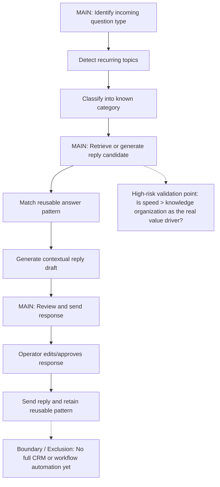

# Stage-02 Dry-Run Output — restaurant-owner AI reply assistant

## 1. Document Metadata
- document_name:
  - restaurant-owner-ai-reply-assistant-stage-02-dry-run
- stage:
  - requirements-analysis
- version:
  - v0.1-dry-run
- status:
  - `provisional`
- owner:
  - AI dry-run
- source_status:
  - `mixed`

## 2. Context and Objective
- current_problem_or_opportunity:
  - Small restaurant operators repeatedly answer similar customer questions in WeChat, with no reusable response structure or durable FAQ memory.
- document_objective:
  - Transform the Stage-01 user-understanding draft into a structured requirements panorama that can support Stage-03 decomposition.
- assumptions:
  - The primary operating mode is chat-based response handling for a small service business.
  - Repeated questions likely cluster around store information, availability, ordering, and basic service clarification.
  - The dominant near-term value is faster and more consistent response handling, not full customer-service automation.
- open_questions:
  - Is the primary operator owner-manager, front-desk staff, or a mixed workflow?
  - Is the product mainly a reply assistant, a reusable FAQ organizer, or both?
  - Does the restaurant need only suggestion support, or also conversation classification / workflow handling?
  - Are there channel/privacy constraints around storing chat history and generated responses?

## 3. Core Structured Output
- goal:
  - Turn repeated customer-question handling into a reusable, structured, and faster response workflow for small restaurant operators.
- backbone_activities:
  - activity:
      - identify incoming customer question type
    tasks:
      - detect recurring topics from chat context
      - classify the question into a known category
    is_main_flow:
      - yes
  - activity:
      - retrieve or generate a suitable reply candidate
    tasks:
      - match the question to reusable answer patterns or FAQ memory
      - generate a response draft adapted to the current context
    is_main_flow:
      - yes
  - activity:
      - review and send the response
    tasks:
      - let the operator approve/edit the response
      - send the reply and keep the answer pattern for reuse
    is_main_flow:
      - yes
- requirements_panorama:
  - `story-map`
- key_constraints:
  - the primary user boundary is still partially provisional
  - chat privacy / data retention constraints are still unknown
  - the current structure should not assume full automation authority
  - the product should not over-expand into CRM/workflow automation before validating the core value
- initial_priority_split:
  - high_value_first:
      - identify repeated question categories
      - provide reusable reply suggestions
      - allow fast operator review/edit before sending
  - high_risk_to_validate:
      - whether FAQ organization and reply acceleration are both core value drivers
      - whether the main operator is owner-manager or frontline staff
      - whether storing reusable answer memory is operationally acceptable
  - deferrable:
      - advanced routing or workflow automation
      - multi-channel synchronization beyond WeChat
      - deeper analytics / reporting layers
- high_risk_validation_point:
  - whether the core buyer/user values “response speed with low effort” more than “long-term knowledge organization,” because that changes the product center of gravity

## 3.1 Provenance / Confidence / Verification
- source:
  - `mixed`
- confidence:
  - `medium`
- verification:
  - `required`
- assumptions_to_validate:
  - the main flow really starts from repeated customer-question recognition
  - the primary value is reply support rather than a more general operations tool
  - the priority split matches actual operator pain intensity
- what_changes_if_wrong:
  - if the main value is knowledge organization instead of reply speed, the backbone may shift from response handling to FAQ curation
  - if the main user is frontline staff, approval/review flow and permission assumptions may change
- ai_inferred_marker:
  - `AI-INFERRED DRAFT — UNVERIFIED`

## 4. Key Judgments and Constraints
- key_judgments:
  - The Stage-01 output is strong enough to build a plausible whole-picture structure.
  - The structure should remain review-bound because core user-boundary uncertainty still exists.
- key_constraints_interpretation:
  - unknown privacy and governance constraints may limit how reusable answer memory works
  - uncertain user-role ownership may change the exact workflow and interaction priorities
- explicit_exclusions:
  - no MVP slicing yet
  - no UI/architecture definition yet
  - no claim that the current structure is fully confirmed reality

## 5. Diagram / Structured Representation
- requires_uml_or_mermaid:
  - yes
- diagram_type:
  - `story-map`
- diagram_obligation:
  - `required`
- diagram_minimum_elements:
  - at least 3 backbone activities
  - at least 2 tasks under each activity
  - one marked main flow
  - at least one boundary / exclusion
  - at least one high-risk validation point
- fail_action:
  - return to structure building or back to Stage-01 clarification if the panorama cannot be defended

### story_map_evidence

## 6. Acceptance and Flow
- minimum_acceptance:
  - a whole-picture structure exists
  - key constraints exist
  - initial priority split exists
  - Stage-03-consumable handoff exists
- handoff_to:
  - `requirements-decomposition-and-mvp-slicing`
- handoff_package:
  - structured requirements analysis note
  - story-map evidence
  - key constraints list
  - initial priority split
  - high-risk validation point
  - assumptions / open questions
- downstream_usage_rule:
  - Stage-03 may consume this only as explicitly marked review-bound analysis input until the key user-boundary and value assumptions are confirmed

## 7. Referenced Assets
- referenced_cards:
  - whole-picture structure thinking
  - story-map construction
  - value/evidence discipline before flattening into tasks
- referenced_inputs:
  - `../stage-01-user-research/self-test-dry-run-output.md`
