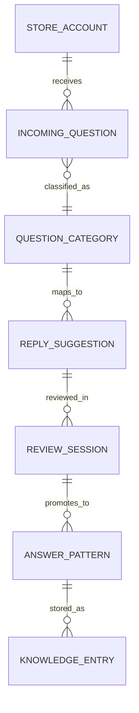

# Stage-02b Dry-Run Output — restaurant-owner AI reply assistant

## 1. Document Metadata
- document_name:
  - restaurant-owner-ai-reply-assistant-stage-02b-dry-run
- stage:
  - requirements-specification-deepening
- version:
  - v0.1-dry-run
- status:
  - `provisional`
- owner:
  - AI dry-run
- source_status:
  - `mixed`

## 2. Context and Objective
- current_problem_or_opportunity:
  - Small restaurant operators need faster, more reusable customer-response handling, but the current panorama does not yet specify what quality attributes, domain objects, or IA choices Stage-03 must respect.
- document_objective:
  - Deepen the Stage-02a structure into specification-grade inputs that can constrain MVP slicing without turning into solution architecture.
- assumptions:
  - The first-wave product is still a reply-assistant / reusable-answer workflow, not a full CRM or service-operations suite.
  - Operators will tolerate provisional answer memory if privacy and editability remain visible.
  - The first slice must optimize for usability and reliability before automation breadth.
- open_questions:
  - What data-retention constraints apply to stored answer memory or chat excerpts?
  - Is the main operator owner-manager, front-desk staff, or both?
  - Does reusable knowledge live mainly as FAQ snippets, answer patterns, or conversation templates?

## 3. Core Structured Output

### 3.1 NFR / Quality Requirements
- key_quality_attributes:
  - usability:
      - why_it_matters:
        - if reply suggestion review/edit is not fast and legible, the operator will abandon the workflow
      - reverse_risk:
        - the product becomes a slower answer tool rather than an accelerator
  - reliability:
      - why_it_matters:
        - repeated question handling depends on stable answer retrieval and consistent reusable memory
      - reverse_risk:
        - operators stop trusting suggestions because retrieval/generation behaves inconsistently
  - privacy_and_data_control:
      - why_it_matters:
        - reusable answer memory may involve customer-message context or store-specific operational details
      - reverse_risk:
        - product adoption fails because data boundaries are unclear
- quality_scenarios:
  - usability:
      - stimulus:
        - operator opens a suggested reply for a common customer question
      - environment:
        - peak chat-handling period with multiple similar messages
      - response:
        - system shows a readable suggestion, editable before send
      - measure:
        - operator can review/edit/send within one short workflow pass
  - reliability:
      - stimulus:
        - the same question pattern appears repeatedly across a week
      - environment:
        - normal day-to-day store operation
      - response:
        - system retrieves or generates consistent reusable answer candidates
      - measure:
        - operators do not see random drift in answer pattern quality for the same class of question
  - privacy_and_data_control:
      - stimulus:
        - store wants to save reusable answer memory
      - environment:
        - mixed owner / staff usage
      - response:
        - system makes stored knowledge scope and edit authority visible
      - measure:
        - reusable memory can be retained without unclear cross-role access

### 3.2 Conceptual Domain Model
- core_entities:
  - Store Account
  - Incoming Question
  - Question Category
  - Reply Suggestion
  - Answer Pattern
  - Review Session
  - Knowledge Entry
- relationship_direction:
  - incoming question -> question category -> reply suggestion -> operator review -> reusable answer pattern / knowledge entry
- data_characteristics:
  - data_window:
      - recent interactions plus reusable answer memory
  - data_sources:
      - operator input, system-generated suggestion, reusable knowledge entries
  - data_sensitivity:
      - customer-message excerpts and store-specific response content are review-bound
  - volume_estimate:
      - incoming questions and reply review events will grow faster than reusable answer patterns

### 3.3 IA Direction
- organization_strategy:
  - workflow-first around question intake -> suggestion review -> answer reuse
- labeling_direction:
  - use operator language (`question type`, `suggested reply`, `saved answer pattern`) rather than internal model nouns
- navigation_direction:
  - inbox/work queue
  - suggestion review
  - reusable answers / knowledge
  - settings / privacy boundary
- architecture_impact:
  - Stage-03 cannot slice purely by screen shells; it must preserve the question -> suggestion -> review -> reuse object chain

### 3.4 Specification Stress-Test
- blind_spot_if_missing_nfr:
  - Stage-03 could over-slice toward automation and ignore operator editability/usability
- blind_spot_if_missing_domain_model:
  - Stage-03 could confuse reusable answer memory with raw chat history or feature nouns
- blind_spot_if_missing_ia_direction:
  - MVP could be cut as separate inbox/FAQ pages with no continuous operator workflow
- conclusion:
  - Stage-03 should slice around `intake -> suggestion review -> answer reuse`, constrained by usability, reliability, and visible privacy boundaries

## 4. Provenance / Confidence / Verification
- source:
  - `mixed`
- confidence:
  - `medium`
- verification:
  - `required`
- assumptions_to_validate:
  - privacy constraints will allow reusable answer memory
  - usability matters more than advanced automation in first wave
  - reusable answer patterns are a real business object, not just temporary UI state
- what_changes_if_wrong:
  - if privacy constraints are tighter, knowledge-entry persistence may move out of MVP
  - if answer reuse is weaker than expected, the product may focus more on one-off reply acceleration than knowledge accumulation
  - if the main operator differs, IA and review flow authority may change
- ai_inferred_marker:
  - `AI-INFERRED DRAFT — UNVERIFIED`

## 5. Acceptance and Handoff
- minimum_acceptance:
  - 3 material quality attributes identified
  - conceptual domain model exists
  - IA direction exists
  - Stage-03-consumable handoff exists
- handoff_to:
  - `requirements-decomposition-and-mvp-slicing`
- handoff_package:
  - NFR / quality requirements summary
  - conceptual domain model + ER diagram
  - data characteristics
  - IA direction decisions
  - specification stress-test outcome
- downstream_usage_rule:
  - Stage-03 may consume this only as explicitly marked review-bound specification input until privacy and operator-role assumptions are validated

## 6. Referenced Assets
- referenced_inputs:
  - `../stage-02-requirements-analysis/self-test-dry-run-output.md`
- referenced_method_families:
  - quality-scenario reasoning
  - conceptual domain modeling
  - IA direction decisions
  - specification stress-test
