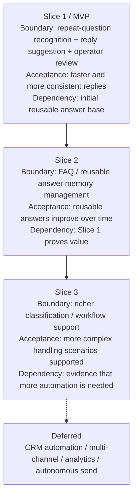

# Stage-03 Dry-Run Output — restaurant-owner AI reply assistant

## 1. Document Metadata
- document_name:
  - restaurant-owner-ai-reply-assistant-stage-03-dry-run
- stage:
  - requirements-decomposition-and-mvp-slicing
- version:
  - v0.1-dry-run
- status:
  - `provisional`
- owner:
  - AI dry-run
- source_status:
  - `mixed`

## 2. Context and Objective
- current_product_goal:
  - Create a reusable and faster response workflow for small restaurant operators handling repeated WeChat customer questions.
- why_slicing_is_needed:
  - The Stage-02 panorama is broad enough that validation should focus on the smallest loop that can prove whether response acceleration and reusable answer memory create real value.
- assumptions:
  - The first meaningful validation target is not full automation, but assisted recognition + suggestion + review.
  - A human-in-the-loop response workflow is sufficient for the first viable slice.
- open_questions:
  - Is suggested-reply value enough on its own, or does reusable FAQ memory need to be visible in the first slice?
  - Does the primary operator need only approval/edit flow, or also simple answer-pattern management in the first slice?

## 3. Core Structured Output
- complete_experience_loop:
  - A customer sends a repeated question → the system helps identify the question type → a reusable answer candidate is retrieved/generated → the operator reviews/edits it → the reply is sent → the useful answer pattern is retained for future reuse.
- minimum_viable_experience_loop:
  - A repeated question is recognized → a reply suggestion is generated from a small reusable answer base → the operator edits/approves → the answer is sent.
- first_slice:
  - capability_boundary:
      - repeated-question recognition for a limited set of common question types
      - reusable reply suggestion generation
      - operator review/edit before send
    acceptance_target:
      - an operator can handle recurring customer questions faster and more consistently with a human-in-the-loop suggestion workflow
    key_dependency:
      - enough common question categories and initial reusable answer patterns must be available
- later_slices:
  - slice_2:
      - capability_boundary:
          - lightweight FAQ / reusable answer memory management
      acceptance_target:
          - operators can maintain and improve reusable answers over time
      key_dependency:
          - the first slice proves that repeat-question handling actually creates value
  - slice_3:
      - capability_boundary:
          - richer classification and optional workflow support
      acceptance_target:
          - more complex customer-question scenarios can be routed more effectively
      key_dependency:
          - evidence that more advanced automation is necessary and acceptable
- deferred_items:
  - full CRM/workflow automation
  - multi-channel support beyond WeChat
  - advanced analytics and reporting
  - autonomous reply sending without human review
- slice_rationale:
  - value_reason:
      - the smallest high-value loop is helping with repeated replies, because the user brief strongly points to repeated-question response burden
  - risk_reason:
      - keeping a human-in-the-loop reduces operational and trust risk while testing whether suggestion quality is sufficient
  - dependency_reason:
      - advanced FAQ management and automation depend on first proving that repeat-question recognition and assisted reply generation work in practice
- key_assumptions_to_validate:
  - response-speed improvement is the primary perceived value
  - a small reusable answer base is enough to deliver early value
  - operators are willing to review/edit AI suggestions rather than expecting fully automatic handling

## 3.1 Provenance / Confidence / Verification
- source:
  - `mixed`
- confidence:
  - `medium`
- verification:
  - `required`
- assumptions_to_validate:
  - the MVP loop chosen here is truly the smallest meaningful value loop
  - FAQ memory management can safely wait until a later slice
  - the human review step does not eliminate the value proposition
- what_changes_if_wrong:
  - if reusable FAQ memory is actually part of the first meaningful value loop, the first slice boundary is too narrow
  - if users need stronger organization features immediately, Slice 2 may need to move into the MVP boundary
- ai_inferred_marker:
  - `AI-INFERRED DRAFT — UNVERIFIED`

## 4. Key Judgments and Constraints
- slicing_basis:
  - cut the first slice around the smallest loop that can prove repeat-question assistance value without expanding into full workflow automation
- major_constraints:
  - upstream user boundary is still partially provisional
  - privacy and data retention constraints are still unknown
  - full automation should remain outside the first slice until trust/value is proven
- explicit_exclusions:
  - no validation result claims yet
  - no technical architecture definition yet
  - no autonomous send behavior in the first slice

## 5. Diagram / Structured Representation
- requires_uml_or_mermaid:
  - yes
- diagram_type:
  - `slice-map`
- diagram_obligation:
  - `required`
- diagram_minimum_elements:
  - at least 2 slices
  - each slice includes capability boundary
  - each slice includes acceptance target
  - each slice includes key dependency
  - deferred items are explicit
- fail_action:
  - return to slice logic work; if the viable loop cannot be justified, return to Stage-02 structure clarification

### slice_map_evidence

## 6. Acceptance and Flow
- minimum_acceptance:
  - minimum viable experience loop exists
  - first / later / deferred items are explicit
  - slice logic is explainable
  - slice-map evidence exists
  - Stage-04-consumable handoff exists
- handoff_to:
  - `requirements-validation-and-concept-proof`
- handoff_package:
  - MVP definition
  - slice explanation
  - slice-map evidence
  - key assumptions to validate
  - deferred items and rationale
- downstream_usage_rule:
  - Stage-04 may consume this only as explicitly marked review-bound validation input until key value/user assumptions are confirmed

## 7. Referenced Assets
- referenced_cards:
  - MVP slicing by story-map
  - early-value delivery thinking
  - structured decomposition discipline
- referenced_inputs:
  - `../stage-02-requirements-analysis/self-test-dry-run-output.md`
