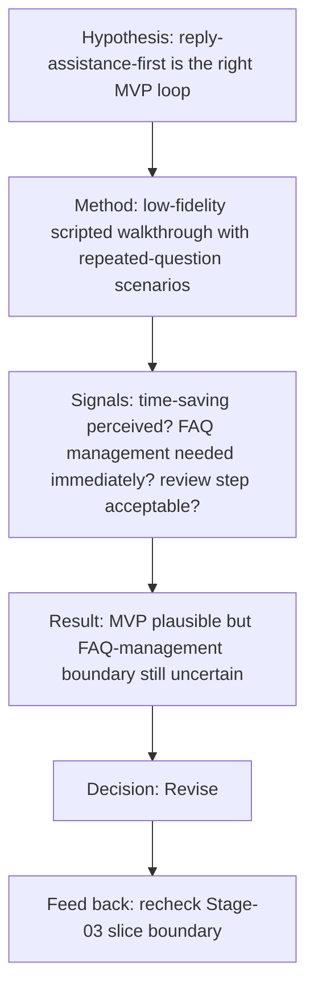

# Stage-04 Dry-Run Output — restaurant-owner AI reply assistant

## 1. Document Metadata
- document_name:
  - restaurant-owner-ai-reply-assistant-stage-04-dry-run
- stage:
  - requirements-validation-and-concept-proof
- version:
  - v0.1-dry-run
- status:
  - `provisional`
- owner:
  - AI dry-run
- source_status:
  - `mixed`

## 2. Context and Objective
- current_validation_target:
  - Validate whether the proposed MVP slice (repeat-question recognition + reply suggestion + human review) is the right smallest loop for early value.
- validation_objective:
  - Determine whether the first slice should stay focused on reply assistance, or whether reusable answer memory must already be inside the MVP boundary.
- assumptions:
  - Response acceleration is likely the most visible user value.
  - Human-in-the-loop review is acceptable for the first slice.
- open_questions:
  - Will users perceive enough value without lightweight FAQ management in the MVP?
  - Is the review step acceptable, or does it make the workflow too heavy?

## 3. Core Structured Output
- hypothesis_or_validation_target:
  - The smallest meaningful MVP loop is assisted repeated-question handling with human review, without requiring FAQ management in the first slice.
- validation_method:
  - Run a lightweight concept test with a low-fidelity workflow prototype / scripted walkthrough and ask target-like operators to evaluate whether this first-slice loop already solves their most painful repeated-question burden.
- prototype_or_equivalent_artifact:
  - low-fidelity flow walkthrough with 3 repeated question scenarios:
    - store-hours question
    - reservation question
    - menu/delivery question
- feedback_or_signal:
  - Expected acceptance signal:
    - operators say the first slice would already save time in common repeated-question scenarios
  - Expected caution signal:
    - operators say reusable FAQ management is necessary immediately, not later
  - Expected risk signal:
    - operators feel human review makes the flow too slow to matter
- validation_conclusion:
  - `Revise`
  - The assisted-reply-first MVP remains plausible, but the current evidence chain suggests FAQ management may need to move closer to the MVP boundary if operators see reusable answer management as inseparable from response efficiency.
- decision_state:
  - `Revise`
- revision_recommendations:
  - revise Stage-03 slicing review criteria so that Slice 1 and Slice 2 are re-examined together
  - validate whether a lightweight answer-memory edit capability must be pulled into the MVP boundary
  - preserve the human-in-the-loop assumption for now; do not expand to autonomous reply sending

## 3.1 Provenance / Confidence / Verification
- source:
  - `mixed`
- confidence:
  - `medium`
- verification:
  - `required`
- assumptions_to_validate:
  - FAQ management can truly wait until after the first slice
  - the review step is acceptable from a time-cost perspective
  - the first slice creates enough visible value to justify continued investment
- what_changes_if_wrong:
  - if FAQ management is essential immediately, the MVP boundary must expand
  - if the review step is too heavy, the first-slice workflow must be redesigned
- ai_inferred_marker:
  - `AI-INFERRED DRAFT — UNVERIFIED`

## 4. Key Judgments and Constraints
- key_judgments:
  - The first-slice logic is directionally sound, but not yet strong enough to freeze without validation feedback.
  - The strongest uncertainty sits at the boundary between “reply suggestion” and “answer memory management.”
- key_constraints:
  - no real external user evidence has been collected in this dry-run
  - upstream user/value assumptions remain review-bound
- explicit_exclusions:
  - no claim of proven market fit
  - no architecture decision
  - no high-fidelity prototype commitment

## 5. Diagram / Structured Representation
- requires_uml_or_mermaid:
  - optional but recommended
- diagram_type:
  - `validation-flow`
- diagram_obligation:
  - `recommended`
- diagram_minimum_elements:
  - hypothesis
  - method
  - threshold/signal
  - result
  - decision
- fail_action:
  - return to target/method clarification if the validation chain is unclear

### validation_flow_evidence

## 6. Acceptance and Flow
- minimum_acceptance:
  - validation target exists
  - validation record exists
  - decision state exists
  - revision recommendation exists
  - design/architecture-consumable handoff exists
- handoff_to:
  - design / architecture
- handoff_package:
  - validation conclusion
  - validation record
  - prototype/equivalent artifact
  - revision recommendation
  - unresolved risks
- downstream_usage_rule:
  - design/architecture may consume this only as explicitly marked review-bound validation output until the hypothesis is validated with real external evidence

## 7. Referenced Assets
- referenced_cards:
  - validated learning loop
  - build-measure-learn loop
  - prototype/validation linkage
- referenced_inputs:
  - `../stage-03-requirements-decomposition/self-test-dry-run-output.md`
