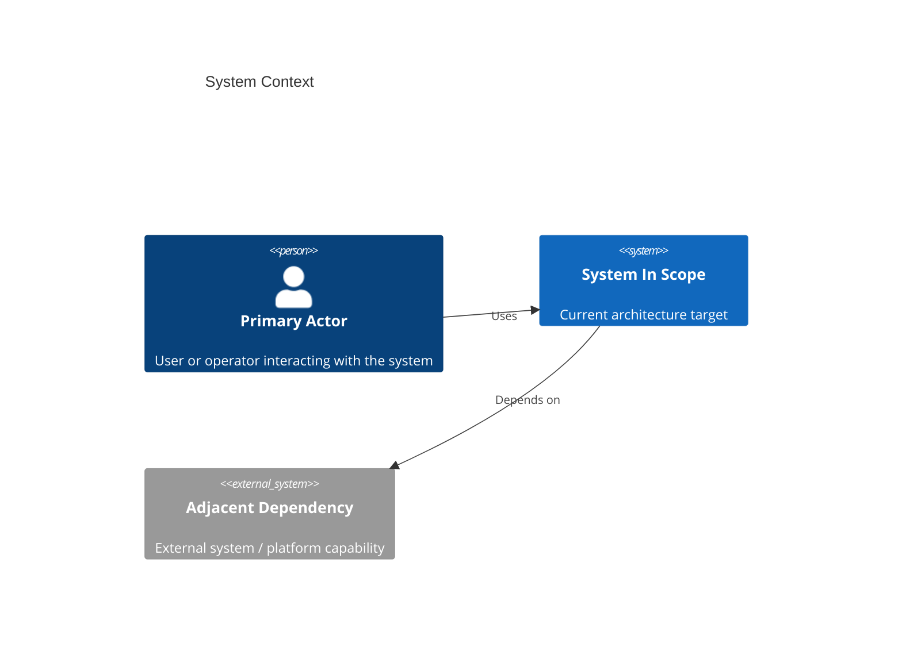
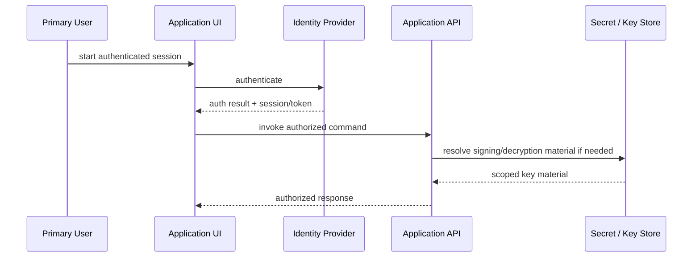

# Stage-01 Output Template — architecture-definition-and-boundary-setting

## 1. Document Metadata
- document_name:
- stage:
  - architecture-definition-and-boundary-setting
- version:
- status:
  - `draft | provisional | review | approved`
- owner:
- source_status:
  - `user-confirmed | provisional | mixed`

## 1.1 Traceability Naming and Registry
- artifact_id:
- artifact_type:
  - `ARCH | BOUNDARY | CAPABILITY | DECISION | ASSUME`
- depends_on:
- feeds:
- source_path:
- source_anchor:
- traceability_managed_by:
  - `wff-base-traceability-management`
- trace_binding_note:
  - artifact identity and upstream/downstream relations should be allocated and managed through the `wff-base-traceability-management` skill, not free-typed manually

## 2. Context and Objective
- current_architecture_target:
- architecture_objective:
- upstream_handoff_summary:
- assumptions:
- open_questions:

## 3. Core Structured Output
- system_boundary_statement:
  - in_scope:
  - adjacent_systems_or_external_dependencies:
  - explicit_out_of_scope:
- constraints:
  - inherited_constraints:
  - inferred_constraints:
  - unknown_constraints:
  - deferred_constraints:
- quality_attribute_structure:
  - upstream_nfr_state:
    - `present | absent | unknown | deferred`
  - architecture_facing_quality_attributes:
    - minimum_count: `>=4`
    - required_entry_template:
      - qa_id:
      - attribute_name:
      - scenario_or_workload:
      - quantified_target:
        - metric_name:
        - target_value:
        - measurement_window:
      - design_implication:
      - evidence_or_source:
  - unresolved_quality_gaps:
- critical_dependency_realizability_scan:
  - dependency_name:
  - required_capability_or_boundary_edge:
  - realizability_status:
    - `confirmed | partial | unknown | unavailable`
  - evidence_basis:
  - blocking_risk_if_absent:
- first_pass_realization_mode:
  - `direct-dependency | substitute-boundary | mixed | review-bound`
- substitute_boundary_candidates:
  - dependency_or_edge:
  - substitute_or_stub_strategy:
  - accepted_tradeoff:
  - reopen_trigger:
- security_architecture_sketch:
  - trust_boundaries:
  - identity_and_access_posture:
  - auth_sequence_direction:
  - authentication_sequence:
    - sequence_diagram:
    - token_strategy:
    - token_lifetime:
    - refresh_mechanism:
    - revocation_approach:
  - credential_or_session_posture:
  - key_management_posture:
    - key_types:
    - storage:
    - rotation_policy:
    - access_control:
  - sensitive_data_or_sensitive_actions:
  - audit_sensitive_edges:
  - unresolved_security_questions:
  - gate_note:
    - these fields must describe a concrete auth flow and secret/session posture; generic wording such as `RBAC applies` without sequence-diagram or key-handling detail does not satisfy Stage-01 depth
- capacity_estimation:
  - load_assumption_basis:
  - dominant_peak_patterns:
  - order_of_magnitude_throughput_or_volume:
  - latency_or_freshness_posture:
  - growth_or_retention_pressure:
  - tps_target:
  - p95_latency_target_ms:
  - storage_growth_per_month:
  - peak_multiplier:
  - unresolved_capacity_questions:
- forbidden_assumptions_registry:
  - fa_1:
    - original_text: (exact text from Phase-1 handoff forbidden_assumptions)
    - source: (Phase-1 Stage-04 handoff / PRD §18 / etc.)
    - architecture_constraint_mapping: (how this forbidden assumption translates to an architecture constraint or exclusion)
    - compliance_status: `compliant | acknowledged-with-risk | needs-clarification`
    - evidence_reference:
    - evidence_strength:
      - `externally-verified | internally-grounded | evidence-needed`
    - compliance_note: (what architecture decisions respect this constraint, or what risk remains if only acknowledged)
  - fa_2:
    - ...
  - (repeat for each forbidden assumption)
- forbidden_assumptions_summary:
  - total_received: (count)
  - compliant: (count)
  - acknowledged_with_risk: (count)
  - needs_clarification: (count)
  - all_addressed: `yes | no`
- capability_map:
  - minimum_group_count: `>=3`
  - required_group_template:
    - capability_group_1:
      - name:
      - priority:
        - `P0 | P1 | P2`
      - maturity:
        - `core | expanding | planned | experimental`
      - rationale:
      - covers:
  - support_domain_alignment_rule:
    - if Stage-02 is expected to introduce a support/shared platform domain, Stage-01 must either:
      - include a matching capability group now
      - or reserve an explicit support/platform capability lane and explain why it is not yet modeled as a first-wave core group
  - gate_note:
    - capability-group names alone are insufficient; each group must carry priority, maturity, and rationale
- architecture_direction:
- phase_1_design_contract_absorption_plan:
  - required_input:
    - Phase-1 PRD `Phase-2 Design Input Contract`
  - purpose:
    - define which Phase-1 trace units are absorbed directly in Stage-01 decision rows and which are intentionally carried forward to Stage-03 / Stage-04
  - preferred_expression:
    - machine-readable table
  - recommended_headers:
    - `phase1_trace_id | unit_type | required_phase2_surface | stage_owner | direct_artifact_id_or_target | note`
- key_architecture_decisions:
  - minimum_count: `>=7`
  - entry_rule:
    - each decision must be authored as one structured ADR entry, not a bare `AD-XX` bullet
    - recommended wrapper:
      - `adr_01`, `adr_02`, ...
  - required_adr_template:
    - adr_id_wrapper:
    - ad_id:
    - title:
    - status:
      - `Proposed | Accepted | Deprecated | Superseded`
    - context:
    - decision:
    - alternatives_considered:
      - minimum_count: `>=2`
      - required_entry_template:
        - alternative_name:
        - rejected_because:
    - consequences:
      - positive:
      - negative:
      - risks:
    - evidence:
  - gate_note:
    - counting `AD-XX` labels alone does not satisfy the Stage-01 architecture-decision gate
- decision_trace_registry:
  - minimum_count:
    - must cover every ADR row
  - preferred_expression:
    - machine-readable table
  - required_table_template:
    - trace_id:
      - example: `P2-DTR-01`
    - adr_id:
    - decision_title:
    - origin_type:
      - `p1-derived | p2-originated | mixed`
    - upstream_trace_ids:
    - upstream_reference:
    - semantic_bridge_note:
    - downstream_artifact_id:
    - verification_hook:
- downstream_assumption_contract:
  - downstream_may_assume:
  - downstream_must_not_assume:
  - required_revalidation_point:
- uncertainty_budget_rule:
  - prefer bounded defaults or policy-configurable guardrails when the architecture shape does not fork
  - keep each unresolved boundary fact in one canonical place; do not repeat the same `unknown` / `deferred` marker across constraints, QA, capacity, and downstream assumption sections
  - workflow failure states are valid domain semantics, not uncertainty-budget markers

## 3.1 Review-Bound Ceiling
- review_bound_ratio_ceiling: `30%`
- review_bound_ratio_enforcement:
  - count all structured output items in this stage (decisions, constraints, boundary items, FA items, NFR items, etc.)
  - include dependency realizability entries and downstream assumption items in the count
  - count items that remain genuinely unresolved and are marked `review-bound`, `unknown`, or `deferred`
  - do not consume uncertainty budget by merely describing workflow failure states such as clarification or blocked execution
  - if ratio > 30%: stage output is flagged as `over-uncertain` and requires explicit justification or resolution attempt for top 3 items before gate-pass
  - if ratio > 50%: stage **cannot pass gate**
- current_review_bound_count:
- current_total_structured_items:
- current_ratio:

## 3.2 Provenance / Confidence / Verification
- source:
  - `user | inferred | external | mixed`
- confidence_profile:
  - input_confidence:
    - `confirmed | partially-confirmed | inferred`
  - evidence_strength:
    - `externally-verified | internally-grounded | evidence-needed | not-applicable`
  - design_stability:
    - `stable | provisional | review-bound`
  - optimality_confidence:
    - `best-known-fit | acceptable-only | unsettled | not-applicable`
- verification:
  - `required | waived | confirmed`
- assumptions_to_validate:
- what_changes_if_wrong:
- ai_inferred_marker:
  - `AI-INFERRED DRAFT — UNVERIFIED` (required if provisional content exists)

## 4. Key Judgments and Constraints
- key_judgments:
- key_constraints:
- explicit_exclusions:

## 5. Diagram / Structured Representation
- requires_uml_or_mermaid:
  - Mermaid required
- diagram_type:
  - `system-context (C4Context required) | capability-map (flowchart TD required) | auth-sequence (Mermaid sequenceDiagram required)`
- diagram_obligation:
  - `required`
- diagram_minimum_elements:
  - system boundary
  - adjacent systems or actors
  - major capabilities or capability groupings
  - critical constraints or labels where needed
- fail_action:
  - return to boundary/constraint clarification if the boundary or capability structure cannot be expressed clearly

### 5.1 Mermaid Placeholder — System Context / Boundary View

> `C4Context` is mandatory here. Plain `flowchart` is not an equivalent substitute for the official Phase-2 run.



### 5.2 Mermaid Placeholder — Capability Map View
```mermaid
flowchart TD
    CapabilityA[Capability Group A<br/>priority=P0 | maturity=core]
    CapabilityB[Capability Group B<br/>priority=P1 | maturity=expanding]
    CapabilityC[Capability Group C<br/>priority=P2 | maturity=planned]
    CapabilityA --> CapabilityB
    CapabilityB --> CapabilityC
```

> Each capability-group node should mirror the structured `priority` / `maturity` labels from `## 3. Core Structured Output`.

### 5.3 Mermaid Placeholder — Authentication Sequence


## 6. Acceptance and Flow
- minimum_acceptance:
  - explicit system boundary exists
  - inherited vs inferred/unknown/deferred constraints are explicit
  - upstream NFR state is explicit
  - critical dependency realizability is explicit for boundary-shaping dependencies
  - substitute-boundary candidates or explicit no-substitute judgment are present where needed
  - security architecture sketch exists
  - capacity estimation exists
  - capability map exists
  - architecture direction exists
  - key architecture decisions exist
  - downstream assumption contract exists
  - Stage-02 handoff package exists
- handoff_to:
  - domain-module-service-decomposition
- handoff_package:
  - system boundary statement
  - constraints structure
  - quality-attribute / NFR handling note
  - critical dependency realizability scan
  - first-pass realization mode
  - substitute-boundary candidates
  - security architecture sketch
  - capacity estimation
  - capability map
  - architecture direction
  - key architecture decisions
  - downstream assumption contract
  - assumptions / open questions / review-bound inputs
- downstream_usage_rule:
  - downstream may consume provisional content only as explicitly marked review-bound architecture input
  - downstream must not infer that NFRs are complete unless upstream state is explicitly `present`
  - downstream must not assume a critical dependency is production-realized unless the realizability status is `confirmed`
- handoff_decision:
  - `pass | pass-with-review-bound-items | return`
- downstream_review_bound_inputs:
- handoff_checklist_reference:
  - `templates/handoff-checklist.md`
- handoff_contract_reference:
  - `templates/handoff-contract.md`

## 7. Referenced Assets
- referenced_cards:
- referenced_inputs:

## 8. Core Business Deliverables Coverage
- checklist_reference:
  - `docs/phases/phase-2/stage-2-core-business-deliverables-checklist-v0.1.md`
- core_deliverables_covered:
  - system boundary statement
  - constraint posture
  - quality attribute / NFR absorption structure
  - critical dependency realizability scan
  - security architecture sketch
  - capacity estimation
  - capability map
  - architecture direction
  - key architecture decisions
  - downstream assumption contract
- core_deliverables_pending:
  - domain map
  - module map
  - service candidates
  - data model summary
  - interface contracts
  - implementation-facing handoff package
