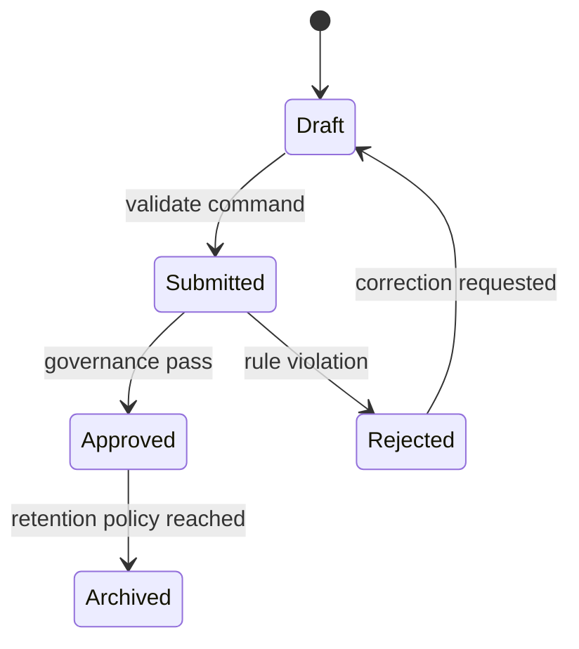
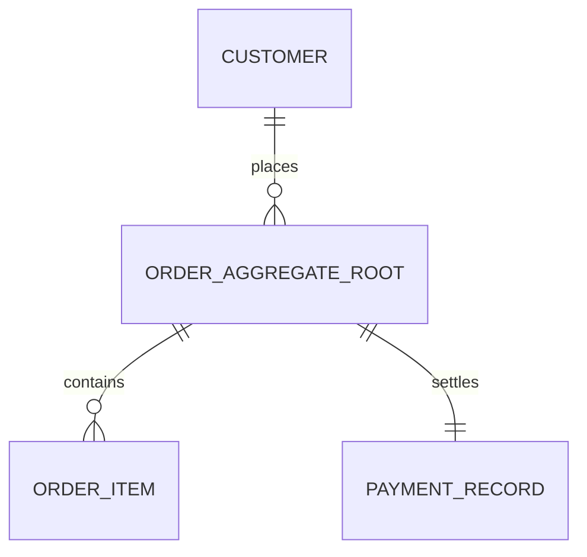

# Stage-02 Output Template — domain-module-service-decomposition

## 1. Document Metadata
- document_name:
- stage: `domain-module-service-decomposition`
- version:
- status: `draft | provisional | review | approved`
- source_status: `user-confirmed | provisional | mixed`

## 1.1 Traceability Naming and Registry
- artifact_id:
- artifact_type:
  - `ARCH | DOMAIN | MODULE | SERVICE | ENTITY | EVENT | DEPENDENCY | ASSUME`
- depends_on:
- feeds:
- source_path:
- source_anchor:
- traceability_managed_by:
  - `wff-base-traceability-management`
- trace_binding_note:
  - artifact identity and upstream/downstream relations should be allocated and managed through the `wff-base-traceability-management` skill, not free-typed manually

## 2. Context and Objective
- decomposition_objective:
- upstream_boundary_summary:
- upstream_declaration_states:
  - `present | absent | unknown | deferred`
- assumptions:
- open_questions:

## 3. Core Structured Output
- domain_map:
  - minimum_count: `>=4`
  - required_entry_template:
    - domain_name:
    - classification:
      - `core | support | generic`
    - owned_capabilities:
    - upstream_boundary_reference:
- module_map:
- service_candidates:
  - minimum_count: `>=8`
  - required_service_template:
    - service_name:
    - domain:
    - home_module:
    - service_type:
      - `authoritative-write | orchestration | derived-truth | integration-support | read-assembly | append-only-support | policy-support`
    - owns_or_coordinates:
    - primary_inbound:
    - primary_outbound:
    - purpose:
- phase_1_trace_carry_forward_plan:
  - purpose:
    - preserve the object, module, service, and public-boundary surfaces needed to absorb the Phase-1 contract in Stage-03 / Stage-04 without alias drift
  - preferred_expression:
    - machine-readable table
  - recommended_headers:
    - `phase1_trace_id | driving_object_or_capability | stage_02_surface_owner | downstream_surface_target | naming_rule | carry_forward_note`
- aggregate_catalog:
  - minimum_count: `>=6`
  - preferred_expression:
    - machine-readable table
  - required_table_template:
    - aggregate_name:
    - aggregate_kind:
      - `authoritative-root | derived-authoritative | public-contract-root | read-assembly-root | append-only-root`
    - owning_domain:
    - owning_module:
    - authoritative_service:
    - authoritative_mutations:
    - emitted_events:
    - lifecycle_diagram:
    - public_boundary_status:
      - `public-authoritative | internal-authoritative | public-decision-support | support-authoritative`
- canonical_object_structure:
  - minimum_count:
    - must cover every row from `aggregate_catalog`
  - preferred_expression:
    - machine-readable table
  - required_table_template:
    - object_name:
    - authoritative_aggregate:
    - authoritative_service:
    - primary_identifiers:
    - state_or_version_anchor:
    - backing_schema_or_projection:
    - stage_03_contract_or_endpoint:
    - closure_note:
- responsibility_matrix:
- service_endpoint_mapping:
  - minimum_count: `>=8`
  - preferred_expression:
    - machine-readable table
  - required_table_template:
    - service_name:
    - home_module:
    - stage_03_endpoint_names:
    - public_contracts:
    - primary_owned_object:
    - mapping_note:
- lifecycle_ownership_closure:
  - authoritative lifecycle states mapped to declared owning writers; no read-only downstream consumer required to complete an upstream lifecycle
  - conflict_detection_rule:
  - state_diagram_requirement:
    - minimum_count: `>=3`
    - syntax: `stateDiagram-v2`
    - required_per_entry:
      - aggregate_name:
      - owning_module_or_service:
      - trigger_events:
      - failure_exit:
- aggregate_lifecycle_coverage:
  - minimum_count:
    - must cover every row from `aggregate_catalog`
  - preferred_expression:
    - machine-readable table
  - required_table_template:
    - aggregate_name:
    - lifecycle_expression_type:
      - `stateDiagram-v2 | event-carried | append-only | read-assembly`
    - owner_writer:
    - trigger_events:
    - terminal_or_failure_exit:
    - mermaid_binding:
    - closure_note:
- dependency_collaboration_map:
  - anti_cycle_rules:
  - violation_consequence:
- entity_relationship_diagram:
  - conceptual-only; no physical schema or column design here
  - required_rules:
    - aggregate_root_marker required
    - relationship cardinality labels required
    - include enough conceptual entities or projections that Stage-03 schema tables do not appear out of nowhere
- domain_event_catalog:
  - domain-level producers, consumers, trigger conditions, and delivery/closure notes
  - minimum_count: `>=10`
  - required_entry_template:
    - event_name:
    - producer:
    - consumer:
    - trigger_condition:
    - payload_shape:
    - ordering_semantics:
    - idempotency_rule:
- decomposition_decisions:
- uncertainty_budget_rule:
  - workflow states such as `blocked`, clarification, or retry are lifecycle semantics, not unresolved-truth markers
  - if a seam is explicitly out of scope, record it once in decomposition decisions or seam notes and reference it elsewhere without repeating `deferred`
  - prefer closure-rule or policy-posture wording over per-row review-bound labels when decomposition can proceed without architectural fork

## 3.1 Review-Bound Ceiling
- review_bound_ratio_ceiling: `30%`
- review_bound_ratio_enforcement:
  - count all structured output items in this stage (domains, modules, services, events, decisions, etc.)
  - count items that remain genuinely unresolved and are marked `review-bound`, `unknown`, or `deferred`
  - do not consume uncertainty budget by merely naming lifecycle failure states or policy-denied outcomes
  - if ratio > 30%: stage output is flagged as `over-uncertain` and requires explicit justification or resolution attempt for top 3 items before gate-pass
  - if ratio > 50%: stage **cannot pass gate**
- current_review_bound_count:
- current_total_structured_items:
- current_ratio:

## 3.2 Provenance / Confidence / Verification
- source: `user | inferred | external | mixed`
- confidence_profile:
  - input_confidence: `confirmed | partially-confirmed | inferred`
  - evidence_strength: `externally-verified | internally-grounded | evidence-needed | not-applicable`
  - design_stability: `stable | provisional | review-bound`
  - optimality_confidence: `best-known-fit | acceptable-only | unsettled | not-applicable`
- verification: `required | waived | confirmed`
- assumptions_to_validate:
- what_changes_if_wrong:

## 4. Key Judgments and Constraints
- key_judgments:
- decomposition_constraints:
- nfr_and_quality_state:
  - `present | absent | unknown | deferred`
- boundary_visibility_scope:
  - `public-boundary-only | broader-by-explicit-exception`
- deferred_private_implementation_notes:
- explicit_exclusions:

## 5. Diagram / Structured Representation
- diagram_obligation: `required`
- diagram_type:
  - `decomposition/dependency (flowchart LR required)`
  - `aggregate lifecycle (stateDiagram-v2 required)`
  - `conceptual-entity-relationship (erDiagram required)`
- diagram_minimum_elements:
  - domain/module/service boundaries
  - ownership hints
  - dependency direction
  - core entity relationships or aggregate adjacency hints
- fail_action:
  - return to boundary/decomposition clarification

### 5.1 Mermaid Placeholder — Decomposition / Dependency View

> Dependency structure must use `flowchart LR`; prose-only decomposition lists do not satisfy the Mermaid gate.

### 5.2 Mermaid Placeholder — Aggregate Lifecycle

> Lifecycle output must use `stateDiagram-v2`; prose-only lifecycle descriptions do not satisfy the gate.

### 5.3 Mermaid Placeholder — Conceptual ER

> Mark aggregate roots explicitly and label relationship cardinality.

## 6. Acceptance and Flow
- minimum_acceptance:
  - decomposition is Stage-03-consumable
  - dependencies are explicit
  - service candidates expose canonical home-module and service-type structure rather than name-plus-purpose only
  - aggregate catalog is machine-readable enough that Stage-03 does not need to infer authoritative object boundaries from prose
  - canonical object structure binds each Stage-02 object to future schema and boundary surfaces explicitly
  - every aggregate has explicit lifecycle coverage, even when a standalone Mermaid lifecycle is intentionally not used
  - lifecycle states are owner-realizable and do not require hidden downstream writeback
  - conceptual entity relationships are explicit enough that Stage-03 does not invent them from scratch
  - service candidates already expose their intended Stage-03 endpoint/contract carry-forward instead of relying on loose naming similarity
  - domain event emission/consumption paths are explicit where they affect storage or interface design
  - boundary-visible domain/module/service/object names are explicit without forcing internal class or method naming
  - canonical unresolved items explicit and deduplicated
- handoff_to: `data-storage-and-interface-design`
- handoff_package:
  - domain/module/service maps
  - responsibility matrix
  - lifecycle ownership closure notes
  - dependency map
  - conceptual entity relationship diagram
  - domain event catalog
  - decisions and unresolved items
  - explicit declaration-state and NFR carryover notes

## 7. Referenced Assets
- referenced_cards:
- referenced_inputs:

## 8. Core Business Deliverables Coverage
- checklist_reference:
  - `docs/phases/phase-2/stage-2-core-business-deliverables-checklist-v0.1.md`
- core_deliverables_covered:
  - domain map
  - module map
  - service candidates
  - responsibility matrix
  - lifecycle ownership closure
  - dependency / collaboration map
  - decomposition decisions
  - entity relationship diagram
  - domain event catalog
- core_deliverables_pending:
  - data model summary
  - storage strategy
  - interface contracts
  - architecture convergence summary
