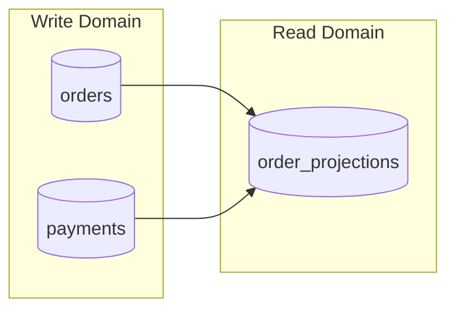
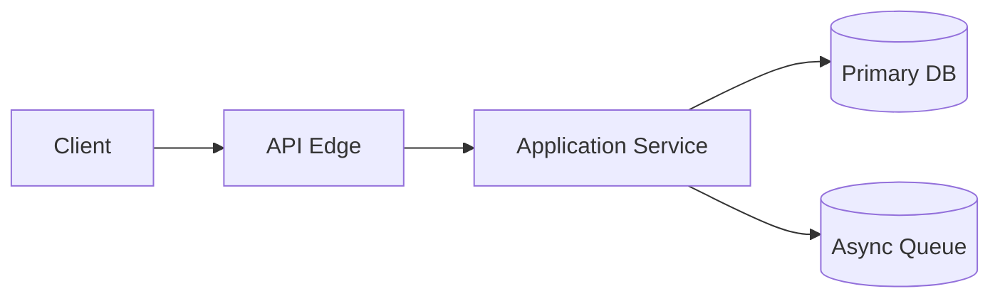

# Stage-03 Output Template — data-storage-and-interface-design

## 1. Document Metadata
- document_name:
- stage: `data-storage-and-interface-design`
- version:
- status: `draft | provisional | review | approved`
- source_status: `user-confirmed | provisional | mixed`

## 1.1 Traceability Naming and Registry
- artifact_id:
- artifact_type:
  - `ARCH | DATA | SCHEMA | STORAGE | INTERFACE | FLOW | SCENARIO | SECURITY | DEPLOY | PERF | TECHSEL | OPTIMAL | ASSUME`
- depends_on:
- feeds:
- source_path:
- source_anchor:
- traceability_managed_by:
  - `wff-base-traceability-management`
- trace_binding_note:
  - artifact identity and upstream/downstream relations should be allocated and managed through the `wff-base-traceability-management` skill, not free-typed manually

## 2. Context and Objective
- design_objective:
- upstream_decomposition_summary:
- upstream_declaration_states:
  - `present | absent | unknown | deferred`
- assumptions:
- open_questions:

## 3. Core Structured Output
- data_model_summary:
- data_ownership_map:
  - use closure or policy notes only where a row truly remains unresolved; do not add a review-bound marker column by default
- storage_strategy:
  - capacity_estimate:
    - initial:
    - one_year:
    - three_year:
  - partition_strategy:
  - archival_rule:
- access_pattern_and_index_strategy:
  - access-pattern-driven mapping between hot query paths and index posture; `index_hint` inside field registries is necessary but not sufficient on its own
  - minimum_access_pattern_count: `>=5`
  - recommended_headers:
    - `access_pattern | touched_tables | predicate_sort_join_keys | expected_selectivity | proposed_index | write_cost_note | validation_hook`
  - gate_note:
    - do not list indexes without connecting them to concrete filters, joins, or sort paths
- implementation_realism_pack:
  - trigger_rule:
    - expand only for the paths actually activated by the case; do not pad this section for untouched concerns
  - json_payload_validation_contract:
    - required_when:
      - `json` / `jsonb` fields carry domain payloads, polymorphic payloads, or user-provided extension content
    - expected_fields:
      - payload_field:
      - validation_rule:
      - versioning_rule:
      - rejection_or_fallback_posture:
  - pagination_strategy:
    - required_when:
      - the design exposes list/search/timeline endpoints or reports with potentially large result sets
    - expected_fields:
      - targeted_endpoints:
      - pagination_model:
        - `cursor | offset | none`
      - default_page_size:
      - max_page_size:
      - deep_pagination_guard:
  - schema_migration_strategy:
    - required_when:
      - the first-pass design introduces schema evolution, backward-compatibility, or rollout sequencing risk
    - expected_fields:
      - migration_tooling_posture:
      - backward_compatibility_rule:
      - version_tagging_convention:
      - rollback_posture:
      - deployment_order_note:
  - concurrency_conflict_handling:
    - required_when:
      - the design allows repeated triggers, concurrent activation, versioned updates, or multi-operator mutation races
    - expected_fields:
      - contested_resource:
      - detection_rule:
      - coordination_strategy:
      - user_or_caller_visible_outcome:
- schema_draft:
  - logical table summary plus per-table field registry; summary-only `fields` strings are not sufficient
  - minimum_table_count: `>=10`
  - required_summary_table_headers:
    - `table_name | ownership | pk | fk | unique_constraints | composite_indexes`
  - required_field_registry:
    - table_field_registry:
      - table_1:
        - table_name:
        - field_matrix:
          | field_name | data_type | nullable | constraints | index_hint |
          |---|---|---|---|---|
        - unique_constraints:
        - composite_indexes:
  - gate_note:
    - `data_type` must be implementation-facing and storage-aware enough to support implementation planning; generic placeholders such as `string`, `number`, `object`, or prose-only field summaries do not satisfy this section
- data_sensitivity_and_compliance_matrix:
  - must cover every table listed in `schema_draft`
  - blanks do not pass; use explicit `none` / `not_applicable` if a table has no PII or extra retention burden
  - recommended_headers:
    - `table_name | pii_level | sensitive_fields | masking_or_encryption | retention_rule | audit_access_rule | compliance_note`
  - gate_note:
    - this is the authoritative Stage-03 surface for PII posture, masking/encryption, retention, and audit-access expectations
- interface_contracts:
  - minimum_structured_schema_count: `>=3`
  - required_contract_template:
    - contract_name:
    - producer:
    - consumer:
    - purpose:
    - schema_form:
      - `json_schema | ts_interface`
    - json_schema:
    - ts_interface:
    - failure_semantics:
    - compatibility_rule:
- response_and_error_contract:
  - response_profile_options:
    - `resource-only | envelope`
  - canonical_success_response:
    - response_profile:
    - required_fields:
    - pagination_meta_rule:
  - canonical_error_response:
    - error_type:
      - `business_error | system_error`
    - error_code:
    - message:
    - retryability:
      - `never | safe_with_backoff | caller_after_fix | idempotency_key_required`
    - caller_action:
    - trace_id:
    - details_shape:
  - classification_rule:
    - use `business_error` for domain/policy/validation conflicts where the caller can remediate
    - use `system_error` for dependency/runtime/unexpected failures where retry, backoff, or escalation posture must stay explicit
  - gate_note:
    - Stage-03 must define a canonical response/error contract; per-endpoint status codes alone do not satisfy response-format and exception-handling depth
- api_endpoint_draft:
  - endpoint or operation name, method or invocation type, request/response shape, and failure semantics
  - minimum_endpoint_count: `>=10`
  - json_example_rule:
    - core public endpoints must include real JSON-shaped request and response examples
    - prose field summaries do not count as JSON examples
    - concise inline JSON or fenced `json` blocks are both acceptable, but they must be parseable JSON rather than pseudo-shape shorthand
  - required_endpoint_template:
    - endpoint_name:
    - method:
    - path:
    - purpose:
    - request_body_example:
    - response_body_example:
    - response_profile:
    - rate_limit_policy:
    - pagination_rule:
    - retryability_policy:
    - idempotency_rule:
    - failure_codes:
      - http_status:
      - error_type:
      - semantic_meaning:
      - caller_action:
  - gate_note:
    - endpoint count and failure semantics are insufficient unless JSON request/response examples, response-profile posture, and retry/idempotency posture are also present
- lifecycle_and_command_consistency_checks:
  - lifecycle ownership closure between state machines and declared writers
  - one primary command boundary per authoritative mutation, with explicit split notes if multiple steps participate
  - no downstream read-only consumer required to mutate upstream truth
- public_boundary_registry_closure:
  - every public-boundary object, contract, snapshot, and endpoint-visible name is defined here, explicitly marked derived/read-only, or recorded once in an out-of-scope seam registry
  - namespace_rule:
  - recommended_registry_template:
    - public_name:
    - namespace:
    - status:
    - origin:
    - closure_note:
- stage_02_event_name_carry_forward:
  - rule:
    - if Stage-03 contracts, APIs, scenarios, or flow notes depend on Stage-02 domain events, preserve the canonical Stage-02 event name or record an explicit alias/mapping once here
  - recommended_mapping_template:
    - stage_02_event_name:
    - stage_03_touchpoints:
    - preserved_name_or_alias:
    - mapping_note:
- contract_trace_registry:
  - minimum_count: `>=5`
  - preferred_expression:
    - machine-readable table
  - explicit_absorption_rule:
    - if Phase-1 carries `return-for-clarification`, boundary-visibility, or navigation-continuity trace units, record them in a dedicated contract/endpoint row instead of assuming the main happy-path contract already covers them
  - required_table_template:
    - trace_id:
      - example: `P2-CTR-01`
    - trace_subject:
    - subject_type:
      - `contract | endpoint | event-mapping | public-boundary`
    - origin_type:
      - `p1-derived | p2-originated | mixed`
    - upstream_trace_ids:
    - semantic_bridge_note:
    - owning_module:
    - downstream_artifact_id:
    - verification_hook:
- interaction_flow:
- scenario_coverage_matrix:
  - all known business scenarios mapped to entities, modules, public services, contracts, and failure notes
  - minimum_scenario_count: `>=8`
  - failure_path_scenarios: `>=2`
  - concurrent_conflict_scenarios: `>=2`
  - coverage_hotspot_rule:
    - if Phase-1 includes trace units for `return-for-clarification`, boundary visibility (`in-scope | later slice | deferred seam | explicit out-of-scope | non-goals`), or `overview -> findings -> tasks -> reports` continuity, bind those traces explicitly here and/or in Stage-04 replay
    - do not assume these concerns are implicitly covered by the primary happy-path scenario
  - scenario_label_rule:
    - label scenario intent explicitly with a category column such as `scenario_type` / `scenario_category` / `scenario_kind`
    - concurrent conflict rows must stay visible rather than being buried inside generic happy-path wording
  - trace_binding_rule:
    - every scenario row should carry explicit `upstream_trace_ids` pointing to the Phase-1 trace units it absorbs
    - for user-story / use-case coverage, prefer binding scenarios rather than relying on post-hoc prose inference
  - quantified_acceptance_rule:
    - every scenario row must include `acceptance_criteria` with numeric or threshold language
    - every scenario row must include `measurement_hook` identifying the evidence source
    - failure-path rows also need measurable thresholds or exact invariants (for example `0 rows created`, `100% deny+audit`, `exactly one winner`, `p95 under X ms`)
  - gwt_compatible_rule:
    - preserve shape flexibility: explicit `given | when | then` columns are preferred when scenario preconditions materially affect implementation or replay
    - if the matrix does not expose dedicated GWT columns, keep Given/When/Then language inside `acceptance_criteria` so the row remains machine-checkable rather than free prose
    - at minimum, failure-path or concurrent-conflict scenarios should use explicit GWT columns or GWT-keyword acceptance wording
  - concurrency_rule:
    - each `concurrent_conflict` row must identify the contested resource through entity/module columns or an explicit `shared_resource` column
    - each `concurrent_conflict` row must name the coordination strategy in dedicated columns or explicit text such as `optimistic_lock`, `pessimistic_lock`, `retry on version conflict`, `merge`, or `last_write_wins`
  - event_alignment_note:
    - when a scenario is triggered by or terminates on a Stage-02 domain event, keep the canonical event name visible in the scenario row or a referenced event-mapping note
  - recommended_headers:
    - `scenario | scenario_type | upstream_trace_ids | actors | entities | modules | contracts / endpoints | shared_resource | coordination_strategy | failure_note | acceptance_criteria | measurement_hook | given | when | then`
- security_architecture_outline:
  - trust_boundaries:
  - authn_authz_posture:
  - auth_sequence_direction:
  - token_posture:
  - audit_logging_hooks:
  - sensitive_data_handling:
  - key_management_posture:
  - gate_note:
    - auth sequence, token posture, and key-management posture must describe concrete control flow or secret-handling posture; generic `RBAC applies` wording alone does not satisfy the implementation-facing security outline
- critical_external_dependency_realizability:
  - dependency_name:
  - consumed_by_module_or_contract:
  - required_for_paths:
  - realizability_status:
    - `confirmed | partial | unknown | unavailable`
  - evidence_basis:
  - acceptable_substitute_boundary:
  - reopen_trigger:
- substitute_boundary_plan:
  - dependency_or_capability:
  - fallback_mode:
  - contract_delta:
  - data_or_latency_tradeoff:
  - readiness_effect:
- technology_stack_and_deployment_assumptions:
  - application/runtime, persistence stack, integration style, and first-pass deployment topology assumptions
- technology_selection_evaluation_matrix:
  - options, reliability, performance/capacity, scalability, maintainability, development cost, operations/maintenance cost, ecosystem maturity, security/compliance posture, deployment complexity, integration cost/fit, observability, migration path, vendor risk/licensing, evidence sources, final decision, rejection reason
  - time-sensitive claims must be externally verified rather than left as model-memory assertions
  - tradeoff_closure_bundle_rule:
    - if this matrix is authored as a real multi-candidate evaluation, also author `baseline_insufficiency_note`, `constraint_dominant_optimum_candidate`, and `key_tradeoff_decisions`
    - if one of those sections is intentionally omitted, state `not_triggered_because` or `omission_reason` explicitly rather than leaving the section blank
  - depth_rule:
    - every candidate must carry at least `>=10` explicit comparison dimensions with non-placeholder values
    - blank columns do not count toward dimension depth
  - long_term_ops_rule:
    - every candidate must explicitly cover `operations_cost / TCO`, `ecosystem_maturity / community_support`, and `observability`
    - if one of these concerns is intentionally out of scope, explain why rather than leaving the field blank
  - preferred_matrix_headers:
    - `candidate_name | reliability | performance_capacity | scalability | maintainability | development_cost | operations_cost | ecosystem_maturity | security_compliance_posture | deployment_complexity | integration_cost | observability | migration_path | vendor_risk | evidence_sources | final_decision | rejection_reason`
  - flexibility_rule:
    - a structured candidate-entry form is also acceptable if it carries the same comparison dimensions and evidence fields
  - minimum_candidate_count: `>=5`
  - evidence_source_rule:
    - if a candidate is justified with external evidence, each evidence entry must include `source_url` and `verification_date`
    - `verification_date` must be explicit calendar date, not relative wording such as `recently`
  - recommended_candidate_template:
    - candidate_name:
    - summary:
    - reliability:
    - performance_capacity:
    - scalability:
    - maintainability:
    - development_cost:
    - operations_cost:
    - tco_or_ownership_cost_note:
    - ecosystem_maturity:
    - community_support:
    - security_compliance_posture:
    - deployment_complexity:
    - integration_cost:
    - observability:
    - observability_support:
    - migration_path:
    - vendor_risk:
    - evidence_sources:
      - source_url:
      - verification_date:
      - note:
    - final_decision:
    - rejection_reason:
  - gate_note:
    - short candidate tables that only show `summary / evidence / decision / rejection` without `>=10` comparison dimensions do not satisfy this section
- dominant_bottleneck_hypothesis:
  - identify the bottleneck or constraint that dominates architecture choice rather than averaging all dimensions equally
  - required_fields:
    - dominant_constraint:
    - why_this_dominates:
    - measurement_plan:
    - threshold:
    - spike_scope:
- architecture_alternative_candidate_set:
  - materially different candidates, including mainstream baseline and stronger constraint-dominant patterns where applicable
  - minimum_candidate_count: `>=4`
  - bundle_note:
    - this section is the alternative-candidate side of the tradeoff closure bundle
    - do not stop here; close the reasoning with baseline insufficiency, optimum candidate, and key tradeoff decisions
  - required_candidate_template:
    - candidate_name:
    - pros:
    - cons:
    - cost_burden:
    - fit_scenario:
    - reversibility:
- baseline_insufficiency_note:
  - explain why the default/mainstream design is not enough under the dominant constraint set
  - recommended_fields:
    - baseline_candidate:
    - failing_constraint:
    - concrete_failure_mode:
    - threshold_or_signal:
    - why_incremental_tuning_is_not_enough:
    - implication_if_baseline_is_kept:
- constraint_dominant_optimum_candidate:
  - candidate that best satisfies the dominant constraint set, plus accepted tradeoff burden
  - recommended_fields:
    - candidate_name:
    - dominant_constraint_addressed:
    - why_it_wins_over_baseline:
    - accepted_tradeoff_burden:
    - monitor_or_reversal_signal:
- capacity_and_performance_assumptions:
  - throughput, latency, growth, retry/backpressure, and estimation basis with configurable safety margins
- key_tradeoff_decisions:
  - purpose:
    - capture the specific tradeoff closures that justify the chosen architecture, not generic architecture slogans
  - preferred_table_headers:
    - `decision_id | tradeoff_axis | chosen_posture | benefit | cost_or_risk | accepted_because | monitor_or_revisit_trigger`
  - row_rule:
    - prefer `>=3` concrete rows when tradeoff-heavy evaluation is active
    - each row should stay tied to the dominant constraint, baseline insufficiency, or rollback/revisit signal
- downstream_assumption_contract:
  - downstream_may_assume:
  - downstream_must_not_assume:
  - mandatory_revalidation_before_implementation:
- uncertainty_budget_rule:
  - prefer bounded defaults or policy-configurable posture when contract or storage shape does not fork
  - keep one canonical unresolved note per fact; do not repeat the same item across ownership, contracts, scenarios, and handoff notes
  - workflow states such as blocked, clarification, retry, or export fallback are domain semantics, not uncertainty-budget markers

## 3.1 Review-Bound Ceiling
- review_bound_ratio_ceiling: `30%`
- review_bound_ratio_enforcement:
  - count all structured output items in this stage (schema fields, API endpoints, scenarios, tech selection items, etc.)
  - count items that remain genuinely unresolved and are marked `review-bound`, `unknown`, or `deferred`
  - do not consume uncertainty budget by merely documenting failure semantics or lifecycle stop states
  - if ratio > 30%: stage output is flagged as `over-uncertain` and requires explicit justification or resolution attempt for top 3 items before gate-pass
  - if ratio > 50%: stage **cannot pass gate**
- current_review_bound_count:
- current_total_structured_items:
- current_ratio:

## 3.2 Provenance / Confidence / Verification
- source: `user | inferred | external | mixed`
- confidence_profile:
  - input_confidence: `confirmed | partially-confirmed | inferred`
  - evidence_strength: `externally-verified | internally-grounded | evidence-needed | not-applicable`
  - design_stability: `stable | provisional | review-bound`
  - optimality_confidence: `best-known-fit | acceptable-only | unsettled | not-applicable`
- verification: `required | waived | confirmed`
- assumptions_to_validate:
- what_changes_if_wrong:

## 4. Key Judgments and Constraints
- key_judgments:
- key_constraints:
- nfr_and_quality_state:
  - `present | absent | unknown | deferred`
- boundary_visibility_scope:
  - `public-boundary-only | broader-by-explicit-exception`
- deferred_private_implementation_notes:
- explicit_exclusions:

## 5. Diagram / Structured Representation
- diagram_obligation: `required`
- diagram_type:
  - `data-ownership (flowchart LR with subgraph required)`
  - `deployment-assumption (flowchart LR required)`
  - `additional flow optional if it strengthens boundary understanding`
- diagram_minimum_elements:
  - ownership boundaries
  - critical data entities
  - interaction paths
  - failure or exception path hints
  - trust boundary hints
  - critical runtime/deployment anchors
- fail_action:
  - return to Stage-03 clarification

### 5.1 Mermaid Placeholder — Data Ownership View

> Data ownership must use `flowchart LR` with `subgraph` boundaries and explicit ownership labels.

### 5.2 Mermaid Placeholder — Deployment / Trust Boundary View

> Deployment assumptions must use `flowchart LR` and mark trust boundary or network boundary hints explicitly.

## 6. Acceptance and Flow
- minimum_acceptance:
  - data/storage/interface package is Stage-04-consumable
  - schema and endpoint drafts are explicit enough that Stage-04 does not invent them from scratch
  - lifecycle ownership, command boundaries, and public-boundary names are internally consistent
  - security, stack/deployment, and capacity/performance assumptions are explicit; remaining unresolved policy items are deduplicated and carried once
  - technology selection rationale is explicit through a comparison matrix
  - time-sensitive technology facts are backed by external evidence rather than memory-only assertions
  - critical external dependency realizability is explicit
  - substitute-boundary plan is explicit whenever direct dependency realizability is not `confirmed`
  - dominant bottleneck hypothesis is explicit
  - materially different architecture alternatives are evaluated
  - mainstream baseline insufficiency is explicit where the dominant constraint makes it inadequate
  - constraint-dominant optimum candidate is explicit rather than implied
  - all known business scenarios are covered through a scenario matrix
  - Stage-02 event names are carried forward or explicitly mapped where Stage-03 flows depend on them
  - public boundary-visible names and contracts are explicit without forcing internal class or method naming
- handoff_to: `design-convergence-and-delivery-prototype`
- handoff_package:
  - data model summary
  - data ownership map
  - storage rationale
  - schema draft
  - contract set
  - API endpoint draft
  - lifecycle and command consistency checks
  - public-boundary registry closure notes
  - interaction flow
  - scenario coverage matrix
  - security architecture outline
  - critical external dependency realizability
  - substitute-boundary plan
  - technology stack and deployment assumptions
  - technology selection evaluation matrix
  - dominant bottleneck hypothesis
  - architecture alternative candidate set
  - baseline insufficiency note
  - constraint-dominant optimum candidate
  - capacity and performance assumptions
  - unresolved items
  - critical external dependency realizability
  - substitute-boundary plan
  - downstream assumption contract
  - explicit declaration-state and NFR carryover notes
- downstream_review_bound_inputs:

## 7. Referenced Assets
- referenced_cards:
- referenced_inputs:

## 8. Core Business Deliverables Coverage
- checklist_reference:
  - `docs/phases/phase-2/stage-2-core-business-deliverables-checklist-v0.1.md`
- core_deliverables_covered:
  - data model summary
  - data ownership map
  - storage strategy
  - schema draft
  - interface contracts
  - API endpoint draft
  - lifecycle and command consistency checks
  - public-boundary registry closure
  - interaction flow
  - scenario coverage matrix
  - security architecture outline
  - technology stack and deployment assumptions
  - technology selection evaluation matrix
  - dominant bottleneck hypothesis
  - architecture alternative candidate set
  - baseline insufficiency note
  - constraint-dominant optimum candidate
  - capacity and performance assumptions
  - key tradeoff decisions
  - downstream assumption contract
- core_deliverables_pending:
  - architecture convergence summary
  - design verification notes
  - implementation-facing handoff package
