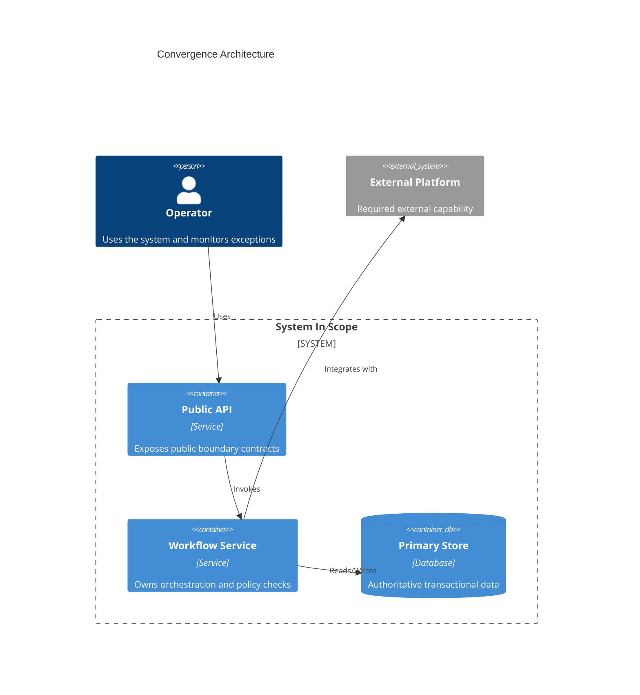
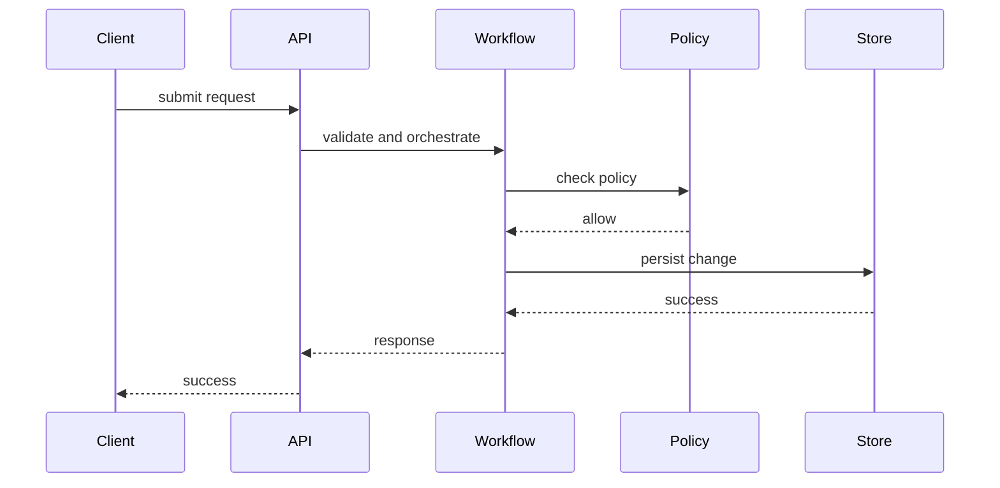
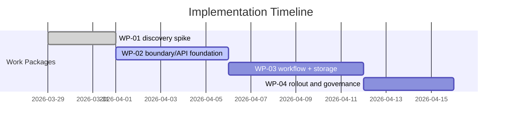

# Stage-04 Output Template — design-convergence-and-delivery-prototype

## 1. Document Metadata
- document_name:
- stage: `design-convergence-and-delivery-prototype`
- version:
- status: `draft | provisional | review | approved`
- source_status: `user-confirmed | provisional | mixed`

## 1.1 Traceability Naming and Registry
- artifact_id:
- artifact_type:
  - `ARCH | HANDOFF | PROTOTYPE | SEQUENCE | VERIFY | RISK | OPTIMAL | ASSUME`
- depends_on:
- feeds:
- source_path:
- source_anchor:
- traceability_managed_by:
  - `wff-base-traceability-management`
- trace_binding_note:
  - artifact identity and upstream/downstream relations should be allocated and managed through the `wff-base-traceability-management` skill, not free-typed manually

## 2. Context and Objective
- convergence_objective:
- upstream_summary:
- upstream_declaration_states:
  - `present | absent | unknown | deferred`
- assumptions:
- open_questions:

## 3. Core Structured Output
- architecture_convergence_summary:
  - required_diagram:
    - syntax: `C4Container`
    - note: plain `flowchart` is not an equivalent substitute for the convergence architecture view
- prototype_or_structured_delivery_expression:
- critical_interaction_sequence_set:
  - sequence views only for critical public-boundary scenarios; internal private choreography optional appendix only
  - minimum_count: `>=3`
  - required_scenarios:
    - happy_path
    - retry_or_clarification_path
    - governance_or_policy_block_path
  - coverage_note:
    - sequence coverage strengthens realism, but does not replace explicit Stage-03 scenario bindings or Stage-04 replay bindings for the Phase-1 coverage contract
- optimality_review:
  - restate dominant bottleneck, alternatives considered, baseline insufficiency, and why chosen candidate is stronger than a merely acceptable baseline
  - acceptable_baseline:
  - optimal_candidate:
  - acceptable_vs_optimal_verdict:
    - `acceptable-only | optimal-under-dominant-constraint`
  - why_optimal_not_just_acceptable:
  - reversibility_posture:
  - dedup_rule:
    - do not restate Stage-03 analysis verbatim
    - reference Stage-03 evidence, then add only convergence-stage incremental judgment
- design_verification_notes:
  - preferred_expression:
    - machine-readable verification table
  - required_checklist_template:
    - check_item:
    - result:
      - `pass | fail | partial`
    - verification_method:
    - evidence:
    - acceptance_rule:
    - residual_gap:
    - linked_rbi_or_wp:
- verification_replay_evidence:
  - minimum_count: `>=3`
  - preferred_expression:
    - machine-readable replay table
  - explicit_absorption_rule:
    - if Phase-1 includes boundary-visibility, navigation-continuity, or clarification-fallback trace units that are not already explicit in Stage-03 scenario/contract tables, bind them here with explicit `upstream_trace_ids`
  - required_table_template:
    - replay_id:
      - example: `P2-RP-01`
    - scenario_or_contract:
    - origin_type:
      - `p1-derived | p2-originated | mixed`
    - upstream_trace_ids:
    - semantic_bridge_note:
    - replay_type:
      - `contract-walkthrough | failure-path-replay | sequence-replay | handoff-consumption-replay`
    - source_artifacts:
    - expected_outcome:
    - observed_outcome:
    - verdict:
      - `pass | fail | partial`
    - evidence_ref:
    - downstream_artifact_id:
    - linked_rbi_or_wp:
- unresolved_risks_and_review_bound_items:
  - required_rbi_template:
    - rbi_id:
    - item:
    - risk_level:
      - `H | M | L`
    - spike_wp:
    - responsible_party:
    - blocks_which_wp:
    - resolution_deadline:
  - canonical_unresolved_ledger_rule:
    - this is the canonical unresolved ledger for implementation intake
    - do not duplicate the same unresolved fact in convergence summary, verification notes, handoff notes, and work-package notes; reference the RBI id instead
- rbi_trace_registry:
  - minimum_count:
    - must cover every RBI row
  - preferred_expression:
    - machine-readable table
  - required_table_template:
    - trace_id:
      - example: `P2-RT-01`
    - rbi_id:
    - origin_type:
      - `p1-derived | p2-originated | mixed`
    - upstream_trace_ids:
    - semantic_bridge_note:
    - bound_wp:
    - downstream_artifact_id:
    - verification_hook:
    - handoff_rule:
- observability_and_operational_readiness:
  - minimum_row_count: `>=4`
  - recommended_headers:
    - `surface | service_or_flow | key_metrics | structured_logs | alert_rule | slo_or_threshold | owner | rollout_guardrail`
  - gate_note:
    - every critical surface must declare logs, metrics, alerts, SLO/threshold, owner, and release/rollout guardrail before implementation intake is treated as ready
- implementation_handoff_package:
- implementation_task_sketch:
  - granularity_rule:
    - `slice | module | work-package only`
  - work_package_registry:
    - minimum_count:
      - must cover every declared `WP-*` id
    - preferred_expression:
      - machine-readable table
    - fte_breakdown_rule:
      - express staffing posture as `fte_count x seniority_mix x complexity_factor`; do not leave effort sizing as a bare duration guess
    - required_table_template:
      - wp_id:
      - scope:
      - acceptance_criteria:
      - estimated_effort:
      - effort_basis:
      - fte_breakdown:
      - team_assumption:
      - depends_on:
      - linked_rbi_or_slice:
      - rollback_or_fallback:
  - recommended_execution_slices:
    - required_slice_template:
      - slice_id:
      - workflow_anchor:
      - completion_signal:
      - acceptance_criteria:
  - sequencing_notes:
  - dependency_notes:
    - for each work-package: state (1) which prior WP must complete first, (2) which external spike/validation must resolve first, and (3) whether an RBI-tagged dependency blocks start; work-packages with no dependency_notes entry are assumed unblocked
  - review_bound_spike_bindings:
    - for each RBI-tagged unresolved item: either assign a named spike/validation WP, or annotate "out of current phase scope" with responsible party; floating unresolved items with no ownership do not pass gate
  - binding_gate_note:
    - every RBI listed in `unresolved_risks_and_review_bound_items` must appear here or in `rbi_matrix` with spike binding / out-of-scope owner
  - gantt_requirement:
    - syntax: `gantt`
    - minimum_count: `>=1`
  - explicit_non_goals:
    - no class/method/file/ticket-level freeze
- identity_and_key_management_choice_posture:
  - required_when:
    - authentication, external provider credentials, tenant separation, or secret rotation materially affect delivery realism
  - expected_fields:
    - recommended_approach:
    - auth_vendor_slot:
      - preferred_expression:
        - machine-readable table
      - recommended_headers:
        - `candidate | fit_for_case | constraints_or_risk | decision_status`
    - token_lifecycle_choice:
      - access_token_lifetime:
      - refresh_strategy:
      - rotation_policy:
      - revocation_guard:
      - session_or_device_binding_note:
    - key_management_operating_posture:
      - secret_storage:
      - rotation_owner:
      - tenant_isolation_note:
    - top_alternatives:
    - why_now:
    - rollout_or_rotation_note:
- glossary_or_onboarding_summary:
  - required_when:
    - the pack is handed to a new implementation team, a parallel squad, or any downstream consumer who was not the original Phase-2 author
  - expected_fields:
    - quick_start_path:
    - environment_or_dependency_prerequisites:
    - term_registry:
      - preferred_expression:
        - machine-readable table
      - recommended_headers:
        - `term | category | working_definition | source_surface`
- uncertainty_budget_rule:
  - `unresolved_risks_and_review_bound_items` is the canonical unresolved ledger for implementation intake
  - do not duplicate the same unresolved fact in convergence summary, verification notes, handoff notes, and work-package notes
  - workflow blocked states inside sequences or lifecycle semantics do not by themselves consume uncertainty budget

## 3.1 Review-Bound Ceiling
- review_bound_ratio_ceiling: `30%`
- review_bound_ratio_enforcement:
  - count all structured output items in this stage (decisions, constraints, sequence views, WPs, RBIs, etc.)
  - count items that remain genuinely unresolved and are marked `review-bound`, `unknown`, or `deferred`
  - do not consume uncertainty budget by merely documenting workflow blocked states, retries, or policy-denied branches
  - if ratio > 30%: stage output is flagged as `over-uncertain` and requires explicit justification or resolution attempt for top 3 items before gate-pass
  - if ratio > 50%: stage **cannot pass gate**
- current_review_bound_count:
- current_total_structured_items:
- current_ratio:

## 3.2 Provenance / Confidence / Verification
- source: `user | inferred | external | mixed`
- confidence_profile:
  - input_confidence: `confirmed | partially-confirmed | inferred`
  - evidence_strength: `externally-verified | internally-grounded | evidence-needed | not-applicable`
  - design_stability: `stable | provisional | review-bound`
  - optimality_confidence: `best-known-fit | acceptable-only | unsettled | not-applicable`
- verification: `required | waived | confirmed`
- assumptions_to_validate:
- what_changes_if_wrong:

## 4. Key Judgments and Constraints
- key_judgments:
- key_constraints:
- nfr_and_quality_state:
  - `present | absent | unknown | deferred`
- boundary_visibility_scope:
  - `public-boundary-only | broader-by-explicit-exception`
- deferred_private_implementation_notes:
- explicit_exclusions:

## 4.1 Realizability Review
- dependency_realizability:
  - for each critical external/platform dependency: `available and usable | available but constrained | unknown / unverified | not available for first-pass realization`
- structural_consistency_gate:
  - lifecycle ownership contradictions: `none | review-bound | blocked`
  - command boundary overlaps: `none | review-bound | blocked`
  - public-boundary name closure gaps: `none | review-bound | blocked`
- delivery_path_realism:
  - `credible | constrained | weak | blocked`
- substitute_boundary_if_needed:
- realizability_judgment:
  - `realizable as designed | realizable only with constrained/simulated boundary | review-bound | blocked for implementation-facing handoff`
- readiness_claim_calibration:
  - strongest_supported_readiness_label: `implementation-planning-ready | pass-with-review-bound-items | ready-to-implement | blocked`
  - why:
  - forbidden_stronger_labels:
  - execution_report_alignment_rule:
    - the final execution-report formal state must not exceed `strongest_supported_readiness_label` without an explicit override rationale
    - if the wrapper-level conclusion is stronger, record the override basis in the execution report instead of silently upgrading the label
- downstream_must_not_assume_from_realizability_review:
- review_round:
  - `initial | revision-1 | revision-2 | revision-n`
- latest_revision_summary:
- blockers_resolved_this_round:
- blockers_remaining:

## 5. Diagram / Structured Representation
- diagram_obligation: `required`
- diagram_type: `convergence-architecture-view | critical-flow-view | critical-sequence-view`
- diagram_minimum_elements:
  - key boundary slices
  - critical interactions
  - critical public-boundary sequence steps
  - unresolved high-risk areas
- fail_action:
  - hard gate: absence of structured visual representation = stage must be downgraded to `blocked`, not `provisional` or `pass`; return to convergence clarification

### 5.1 Mermaid Placeholder — Convergence Architecture

> The convergence architecture view must use `C4Container`.

### 5.2 Mermaid Placeholder — Critical Sequence Set

### 5.3 Mermaid Placeholder — Implementation Timeline

## 6. Acceptance and Flow
- minimum_acceptance:
  - converged package is implementation-consumable
  - unresolved/review-bound items explicit and deduplicated into the canonical RBI ledger
  - realizability review is explicit and non-trivial
  - design verification records method, evidence, acceptance rule, and residual gap instead of result-only checklist rows
  - structural consistency gate is explicit
  - readiness claim is calibrated to verification/confidence/realizability evidence
  - all known business scenarios remain covered through carried-forward scenario coverage evidence
  - critical public-boundary scenarios have explicit sequence views
  - implementation task sketch exists at coarse-grained level
  - technology selection evidence remains explicit where current facts influenced the choice
  - acceptable-vs-optimal distinction is explicit
  - dominant bottleneck and baseline insufficiency remain visible in the final package
  - internal private implementation details are not frozen unless intentionally appended
- handoff_to: `implementation-phase`
- engineering_spec_pack_status:
  - `not-started | partial | converged`
- engineering_spec_pack_reference:
- handoff_package:
  - converged architecture summary
  - delivery expression/prototype notes
  - scenario coverage matrix reference
  - technology selection evaluation matrix reference
  - critical interaction sequence set
  - optimality review
  - verification notes
  - unresolved constraints
  - structural consistency gate result
  - readiness claim calibration
  - implementation task sketch
  - realizability review result
  - engineering spec pack reference if converged
- final_declaration_state_notes:
- downstream_review_bound_inputs:
- downstream_usage_rule:
  - review-bound content may be consumed only as explicitly marked assumptions
- iteration_rule:
  - design may re-enter review after revision; pass is not required on the first review round, but every new round must narrow or clarify the realizability gap

## 7. Execution Report Structure (Mandatory)

When this stage produces the phase execution report, the following sections are **required**:

### 7.1 Deliverable Judgment Matrix
- **Mandatory**: list every deliverable item from all stages (minimum 30 items)
- Each item must have:
  - deliverable_name
  - verdict: `pass | pass-with-review-bound | partial | fail | deferred`
  - evidence_reference: section or artifact where the deliverable exists
  - unresolved_truth: `none | review-bound | unknown | blocked`
  - next_action: what must happen if not fully passed

### 7.2 Forbidden Assumptions Compliance Table
- **Mandatory**: list every forbidden assumption from Phase-1 handoff
- Each must have: fa_id, original_text, compliance_status, architecture_mapping, compliance_note

### 7.3 RBI Register
- **Mandatory**: list all unresolved risks and review-bound items
- Each must have: rbi_id, item, risk_level, spike_wp, responsible_party, blocks_which_wp, resolution_deadline

### 7.4 Quality Self-Assessment
- **Mandatory**: score the overall output on at least 4 dimensions:
  - architecture_decision_depth (0-10)
  - specification_completeness (0-10)
  - visual_representation_quality (0-10)
  - traceability_integrity (0-10)
- Provide an aggregate score and gap analysis to 9.5/10

### 7.5 vs-Baseline Delta Table (Mandatory for Reruns)
- If this is a rerun, compare against the earliest complete baseline on all dimensions
- See `wff-meta-stage-skill-construction-lifecycle` Phase 7 protocol for required format

### 7.6 Review-Bound Ratio Report
- **Mandatory**: count total structured items, count review-bound items, compute ratio
- Flag if ratio > 30%

## 7.9 Referenced Assets
- referenced_cards:
- referenced_inputs:

## 8. Core Business Deliverables Coverage
- checklist_reference:
  - `docs/phases/phase-2/stage-2-core-business-deliverables-checklist-v0.1.md`
- core_deliverables_covered:
  - architecture convergence summary
  - prototype or structured delivery expression
  - critical interaction sequence set
  - optimality review
  - design verification notes
  - unresolved risks and review-bound items
  - realizability review result
  - implementation-facing handoff package
  - implementation task sketch
  - Engineering Spec Pack convergence state
- core_deliverables_pending:
  - none within Phase-2 scope
