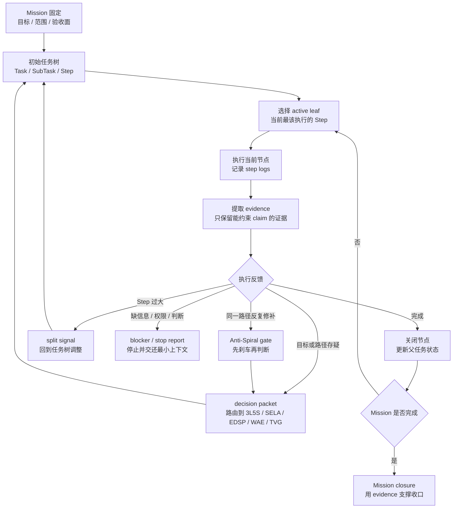

# tplan / Mission-oriented project manager

## 这是什么

`tplan` 是一个 Mission-oriented project manager 和 control plane。它不是普通待办清单，也不是把任务写得更长的格式工具，而是为长任务提供稳定 Mission、任务树状态、证据记录、停止条件和决策入口。

长任务最容易出的问题，不是没有任务，而是任务不断漂移：一开始要解决 A，中途被某个文件、某个测试、某段 prompt 带走，最后 logs 很多，改动很多，却没人能说清 Mission 是否更接近完成。`tplan` 处理的就是这种运行时失控。

它把结构性动作交给脚本，把语义判断交给 agent，把关键 claim 交给 evidence 约束。这样一来，长任务不是靠记忆和感觉继续，而是挂在可检查的 runtime state 上。

## 解决什么问题

`tplan` 解决的是长任务运行中的状态、权威和证据问题。

典型场景包括：

- 一个 Mission 需要跨多个回合、多个文件、多个任务节点持续推进。
- 任务列表越来越长，但不知道哪些任务还服务于原始目标。
- logs 记录了很多过程，却没有 evidence 能支撑继续、停止或验收。
- Agent 想新增子任务、删除任务、切换 active task，但缺少明确 authority。
- 长任务出现局部修补螺旋，需要运行时 brake。
- 用户需要看到当前 Mission 到底推进到了哪里，而不是只看到“我继续改了”。

`tplan` 的价值不是让项目管理更隆重，而是让 agent 在长时间运行时不丢目标函数。

## 核心判断

`tplan` 的核心判断是：Mission 是上位对象，task/subtask/step 都必须相对 Mission 才有意义。

它重点管理四件事：

- `runtime state`：Mission、task、subtask、step 当前处于什么状态。
- `order`：下一步应该推进哪个节点，是否允许切换路径。
- `authority`：谁有权新增、删除、关闭、重排或升级任务。
- `validation`：哪些输出只是 logs，哪些才是 evidence，哪些 evidence 支撑哪个 claim。

`tplan` 不决定 semantic truth。它不会替 `3L5S` 定义问题，不会替 `SELA` 做战略判断，不会替 `EDSP` 建结构坐标。它负责把这些判断放进一个可运行、可追踪、可停止的 Mission 控制面里。

## 怎么用

`tplan` 不是先把计划一次性定完、审批后再按计划执行。更准确地说，它是执行驱动的自适应规划：Mission 固定，任务树可以在证据、阻碍和决策信号约束下持续演化。

一个标准 `tplan` 运行大致是：

1. 初始化 Mission，写清目标、范围、authority 和验收面。
2. 用 `3L5S` 或人工判断提出初始任务树。
3. 通过脚本新增、切换、关闭或归档节点，避免手改状态造成漂移。
4. 记录 step logs，但不把 logs 当 evidence。
5. 对关键 claim 记录 evidence，并说明它支撑什么判断。
6. 遇到路径切换、任务删除、Mission 关闭或高影响继续时，输出 decision packet。
7. 出现第三次局部处理、负反馈、加层冲动或弱 evidence-delta continuation 时，触发 Anti-Spiral gate。

实操中，`tplan` 不需要覆盖所有任务。短小、低风险、一次性工作直接执行即可。它适合那些“如果不记录状态就会漂移”的 Mission。

### 架构流程图

这张图的重点是循环，而不是阶段。执行不会随手重写计划；执行只产生 `logs`、`evidence`、`split`、`blocker`、`decision packet` 或 `Anti-Spiral` 信号。任务树的调整必须经过这些信号和对应 authority，避免 agent 一边执行、一边现场改目标、一边宣布完成。

## 具体案例

### 案例 A：跨多天发布一个多模块版本

假设一次发布需要改 README、多个模块说明、安装脚本、运行脚本和测试。这个 Mission 很容易因为某个局部测试失败或某段文档反复修改而漂移。

`tplan` 会把 Mission 固定下来：哪些 task 负责文档，哪些 task 负责脚本，哪些 claim 需要 evidence，什么时候可以关闭节点，什么时候必须输出 stop report。这样 agent 不只是“继续改”，而是在一个可检查的任务树里推进。

### 案例 B：只改一个错别字不需要 tplan

如果任务只是修一个 README 链接或改一个错别字，启用 `tplan` 会增加无意义的管理成本。直接修改、跑必要检查、提交即可。

这个例子说明 `tplan` 的边界：它服务于会漂移的长任务，不服务于所有任务。

## 常见误用

第一种误用，是把 `tplan` 当语义推理引擎。`tplan` 能保护运行结构，不能替你判断方案是否正确。

第二种误用，是把 logs 当 evidence。日志只说明做过什么，证据要能约束 claim，例如测试输出、diff、用户反馈、真实运行结果或可复现观察。

第三种误用，是为了控制而控制。所有节点都过度脚本化，会让 agent 失去处理不确定性的空间。`tplan` 应该固定状态和权威，不应该冻结判断。

第四种误用，是任务树只加不减。长任务如果一直新增节点，却不删除、合并或关闭，通常已经偏离 Mission。

## 边界

`tplan` 不适合非常短、明确、一次性、低风险的任务。直接执行更有效。

它不替代项目管理工具，也不追求覆盖团队协作的全部现实复杂度。它的重点是 agent runtime：让 agent 在一个 Mission 里知道当前状态、下一步、证据和停止条件。

当问题定义不清时，先用 `3L5S`。当控制边界不清时，用 `WAE`。当同一路径反复修补时，先触发 `Anti-Spiral`，不要继续加任务节点。

## 与其他方法的关系

- `3L5S` 给 `tplan` 提供问题定义和任务拆解。
- `SELA` 可用于 Mission 级取舍，例如继续投入、试点、暂停或转向。
- `EDSP` 可作为 decision hook 处理结构判断。
- `WAE` 解释为什么 `tplan` 要区分脚本状态、agent 判断和 evidence。
- `TVG` 可用于审计 `tplan` 产出的文档、计划或 stop report 是否有下游价值。
- `Anti-Spiral` 是 `tplan` 可吸收的 runtime brake。

## 导航

- 返回 [README](../../README.md)
- 查看 [tplan skill](../../skills/tplan/SKILL.md)
