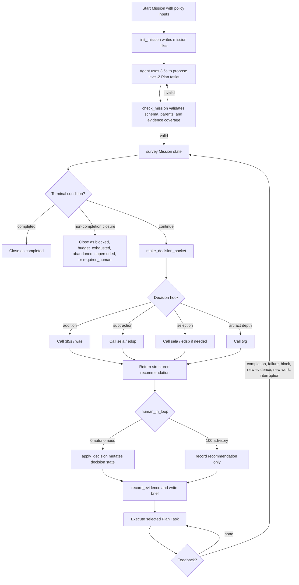
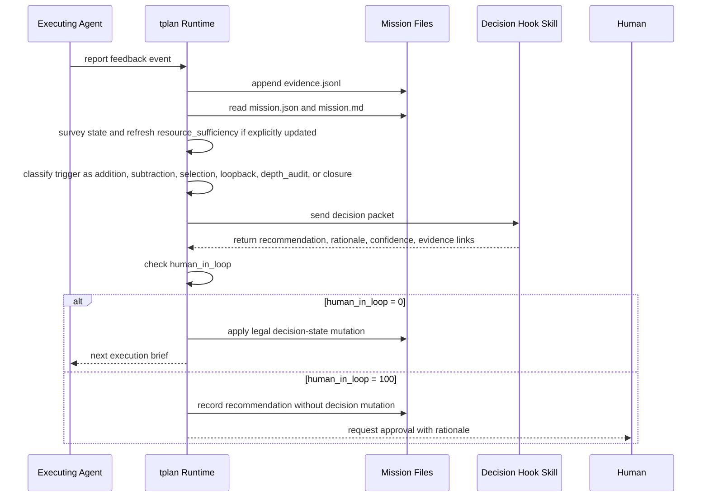

# tplan v0.1 Design

Status: approved design for implementation planning
Date: 2026-04-28

## Goal

Build `tplan` as a Mission-oriented project manager and control plane for Mindthus.
It should keep an AI Agent's task execution attached to a stable Mission, prevent
task-list drift, route semantic decisions to existing Mindthus skills, and make task
state resumable through a script-driven runtime.

v0.1 is not a pure process recorder and not a standalone reasoning engine. It is:

> script-driven Mission runtime + decision hook contracts + minimal policy-guided
> thinking orchestration

## Problems

`tplan` exists to address four recurring AI Agent execution failures:

1. The agent forgets the original task list.
2. New task lists overwrite old task lists.
3. The agent lacks layered priority judgment.
4. The agent goes too deep into one local detail without global judgment.

The design treats these as Mission-control failures rather than isolated memory
failures:

- no stable Mission root
- no mandatory parent attachment for new tasks
- no repeated value filtering relative to Mission ROI
- no subtraction authority when a branch stops being worth its cost

## Scope

### In Scope

`tplan v0.1` owns:

- Mission runtime file layout and templates
- Mission startup policy inputs
- task tree state tracking
- task parent attachment and schema validation
- evidence event append
- legal state transitions
- decision packet generation
- human-in-loop authority checks
- decision hook contracts and routing guidance
- dry-run validation against the four original failures

### Out Of Scope

`tplan v0.1` must not implement its own:

- domain-specific truth judgment
- root-cause analysis method
- task decomposition theory
- pruning theory
- ambiguity-resolution theory
- artifact-depth review theory
- automatic ROI quantification engine
- task-level policy overrides
- multi-agent concurrency control

Those judgments remain delegated to existing Mindthus skills:

- `3l5s`: problem definition, decomposition, loopback
- `sela`: subtraction and Mission-level ROI pressure
- `edsp`: fuzzy structural choices
- `wae`: control boundary and evidence bridges
- `tvg`: artifact depth audit

## Core Concepts

### Spatial Layers

- `Mission`: stable root objective and acceptance evidence.
- `Plan Task`: managed task-tree node that contributes to Mission convergence.
- `Step`: transient execution detail; v0.1 does not persist Steps in the task tree.

### State Categories

`tplan` distinguishes observational state from decision state.

Observational state records facts:

- completed evidence observed
- command failed
- task blocked
- external input received

Decision state records PM decisions:

- split task
- prune task
- downgrade task
- abandon task
- switch active task
- close Mission

In advisory mode, v0.1 may record observational state but must not mutate decision
state without approval.

### Startup Policy Inputs

Mission startup takes three numeric inputs. Internally they use `0-100`; externally
they are interpreted in three coarse bands.

```json
{
  "human_in_loop": 0,
  "risk_tolerance": 50,
  "resource_sufficiency": 50
}
```

`human_in_loop` controls decision authority:

- `0`: autonomous; `tplan` may mutate decision state
- `100`: advisory; `tplan` recommends but does not mutate decision state
- `1-99`: reserved for later mixed/auto modes

`risk_tolerance` controls willingness to spend budget on uncertain future payoff:

- `0-33`: low
- `34-66`: normal
- `67-100`: high

`resource_sufficiency` controls current capacity:

- `0-33`: poor
- `34-66`: normal
- `67-100`: rich

v0.1 stores `resource_sufficiency` as a startup value and permits explicit updates from
events. Automatic resource estimation is deferred.

## Completion And Closure

Mission completion is strict.

A Mission is `completed` only when:

- every success-critical level-2 Plan Task is completed
- Mission acceptance evidence is satisfied

If remaining tasks are no longer worth executing, the Mission is not completed. It is
closed under a non-completion terminal state.

Terminal states:

- `completed`: success-critical level-2 tasks are completed and acceptance evidence is satisfied
- `blocked`: missing input, permission, credential, external access, or evidence prevents progress
- `budget_exhausted`: remaining resource sufficiency is below the threshold for continued work
- `abandoned`: expected Mission ROI is no longer defensible under the risk/resource policy
- `superseded`: a newer Mission or user instruction replaces the current Mission
- `requires_human`: the next decision is unsafe, irreversible, ethically sensitive, or outside delegated authority

Autonomous mode means:

> `tplan` continues managing the Mission until it is completed or no authorized,
> ROI-defensible next action remains.

It does not mean "run forever until success at any cost."

## Runtime Architecture

`tplan v0.1` should be implemented as a skill plus a small script runtime.

Proposed skill layout:

```text
skills/tplan/
├── SKILL.md
├── resources/
│   ├── schema.md
│   ├── lifecycle.md
│   ├── policy.md
│   └── hooks.md
├── templates/
│   ├── mission.json
│   ├── mission.md
│   ├── evidence.jsonl
│   └── hook-output.json
└── scripts/
    ├── init_mission.py
    ├── check_mission.py
    ├── record_evidence.py
    ├── transition_task.py
    ├── survey.py
    ├── make_decision_packet.py
    └── apply_decision.py
```

`SKILL.md` should stay thin. It should explain when to use `tplan`, the control loop,
the boundaries, and which resource files to read.

Scripts should own deterministic runtime operations:

- initialize Mission files
- validate schema and parent links
- append evidence
- enforce legal status transitions
- summarize Mission state
- generate decision packets
- enforce `human_in_loop` authority
- apply approved decision-state mutations

Scripts must not decide semantic truth. They may validate shape, state legality, and
authority only.

## Runtime Flow



## Feedback Sequence



## Decision Hook Contract

Decision hooks are the thinking surface of v0.1. They standardize how `tplan` asks
other Mindthus skills for judgment.

Each hook defines:

- `trigger`: what activates the hook
- `question`: the control question being answered
- `primary_skill`: first skill to invoke
- `support_skill`: optional secondary skill
- `required_inputs`: Mission context that must be passed
- `expected_output`: what `tplan` needs back
- `mutation_rule`: how `human_in_loop` affects state changes

Minimum decision packet inputs:

- Mission objective
- Mission acceptance evidence
- active Plan Task and parent chain
- current task tree summary
- relevant evidence events
- risk tolerance
- resource sufficiency
- human-in-loop value
- current blockers or surprises

Minimum hook output:

```json
{
  "recommendation": "add | subtract | continue | switch | close | escalate",
  "rationale": "why this serves Mission convergence",
  "confidence": 0,
  "evidence_links": [],
  "proposed_mutations": [],
  "requires_human": false
}
```

The hook output is an evidence-linked recommendation, not truth. Scripts may validate
shape and authority. They must not validate semantic correctness.

Initial hooks:

| Hook | Trigger | Primary skill | Expected decision |
| --- | --- | --- | --- |
| `mission_intake` | new Mission | `3l5s` | initial level-2 Plan Tasks and acceptance coverage |
| `addition` | new work or missing dependency appears | `3l5s` | whether to add a task and where to attach it |
| `subtraction` | low value, resource pressure, repeated local expansion | `sela` | prune, downgrade, pause, abandon, or continue |
| `chain_role` | low immediate value but possible path dependency | `wae` | evidence-linked chain-role claim with confidence cap |
| `selection` | multiple candidate Plan Tasks exist | `sela` | next active task or escalation |
| `loopback` | feedback contradicts current definition | `3l5s` | return to Discovery, Definition, or Resolution |
| `depth_audit` | bounded artifact looks complete but shallow | `tvg` | deepen, accept, or escalate |

## Storage Contract

Each Mission uses a directory containing:

- `mission.json`: machine-readable Mission and Plan Task state
- `mission.md`: narrative, decisions, rationale, reflection
- `evidence.jsonl`: append-only evidence event stream
- `archive/`: completed, pruned, abandoned, or superseded branches when archived

v0.1 supports one Mission per working directory by convention. It does not implement
multi-Mission concurrency.

## Minimum `mission.json`

v0.1 may add fields during implementation, but it must include at least this structure
and preserve these names:

```json
{
  "schema_version": "tplan.v0.1",
  "mission": {
    "id": "mission-001",
    "title": "Build tplan L0",
    "objective": "Build a usable L0 tplan skill for Mindthus.",
    "status": "active",
    "human_in_loop": 0,
    "risk_tolerance": 50,
    "resource_sufficiency": 60,
    "acceptance_evidence": []
  },
  "tasks": [
    {
      "id": "T1",
      "parent_id": null,
      "level": 2,
      "title": "Define L0 schema and lifecycle states",
      "status": "pending",
      "role": "success-critical",
      "mission_contribution": "Defines the state contract required for runtime scripts.",
      "acceptance_evidence": [],
      "evidence_links": []
    }
  ],
  "active_task_id": null
}
```

Required task roles:

- `success-critical`: required for Mission completion
- `supporting`: useful but not part of strict Mission completion
- `exploratory`: uncertain payoff, governed by risk/resource policy

Required task statuses:

- `pending`
- `active`
- `blocked`
- `completed`
- `paused`
- `pruned`
- `abandoned`
- `superseded`

## Policy Rules

Risk and resource settings modulate addition and subtraction.

High risk tolerance + rich resources:

- allow exploration
- tolerate low immediate value if chain-role evidence exists
- split tasks more readily

High risk tolerance + poor resources:

- accept uncertainty in principle
- prune weak exploration branches
- prefer the shortest path to Mission evidence

Low risk tolerance + rich resources:

- keep exploration limited
- allow observation without broad branching

Low risk tolerance + poor resources:

- converge aggressively
- prune or abandon low-confidence branches quickly

## Four-Failure Defense

| Original failure | tplan mechanism | Why it helps |
| --- | --- | --- |
| Forgetting the original task list | Mission root, `survey`, required reload of `mission.json` | Active context is reconstructed from durable Mission state. |
| New list overwrites old list | mandatory parent attachment, addition hook, orphan-task validation | New work must enter the existing tree instead of replacing it. |
| No layered priority | Mission-relative value, risk/resource policy, selection hook | Priority is computed relative to Mission convergence. |
| Uncontrolled local depth | subtraction hook, resource sufficiency, closure states | A branch can be pruned, downgraded, paused, or closed before it consumes the Mission. |

## Dry Run Requirement

Implementation is not complete until `tplan` is tested with a sample Mission:

> Build a usable L0 `tplan` skill for Mindthus that can initialize, maintain, and
> validate a Mission task tree.

The dry run must demonstrate:

- Mission initialization creates valid files.
- Mission intake can represent success-critical level-2 tasks.
- `check_mission` rejects orphan tasks and missing acceptance coverage.
- `make_decision_packet` includes Mission objective, parent chain, evidence, policy,
  and authority.
- `human_in_loop=100` blocks decision-state mutation while allowing recommendation
  recording.
- A local deep-dive branch can be represented as downgraded, paused, or pruned.

## Risks

Engineering risks are bounded and testable:

- schema may be incomplete
- state transitions may allow illegal mutation
- decision packets may omit necessary context
- scripts may mutate decision state despite advisory mode

The main unknown is judgment quality inside decision hooks. Hook outputs can be formally
complete but shallow. v0.1 mitigates this by requiring rationale, confidence, and
evidence links, then routing weak bounded artifacts through `tvg` or human review.

## Implementation Readiness

This design is ready for implementation planning. The next step is to create a task-by-task
plan for:

- skill directory and documentation files
- schema and template files
- runtime scripts
- tests and dry-run fixtures
- self-review and validation workflow
